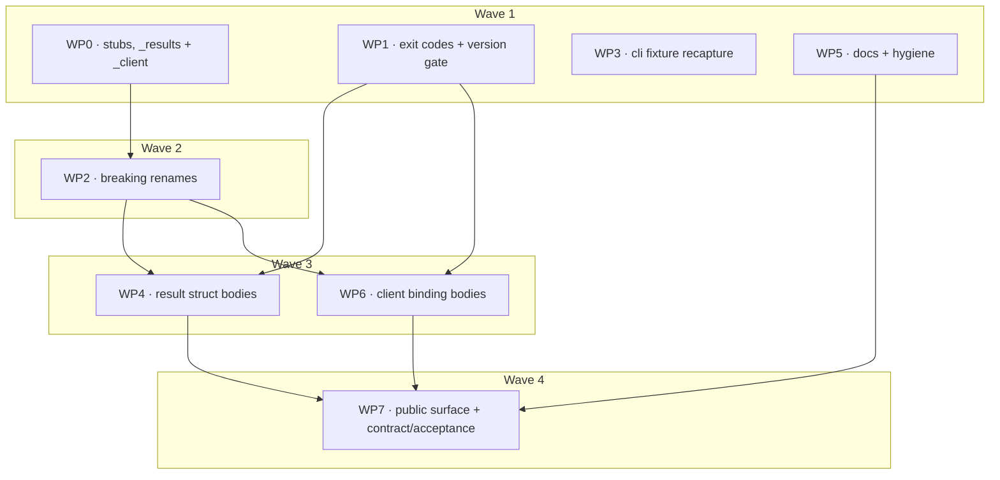

# Plan: ocx-sdk-python 0.2.0 — adopt ocx 0.6.0

## Status
- State:   review        <!-- planning → plan-approved → executing → review → done -->
- Tier:    high
- Updated: 2026-08-31
- Next:    owner review of `hex/0.2.0-ocx-0.6-adoption` @ 7130412 — nothing pushed, `main` untouched.
           **Cross-model adversary gate NOT satisfied**: the `codex:rescue` seat ran as
           Claude Sonnet and said so. Its findings are real (1 Block, since fixed as WP9),
           but no second model family has seen this branch.

## Classification
- Scope: medium–large (8 work packages planned, 4 waves; **10 delivered** — WP8 added for
  D14, WP9 added for the adversary gate's findings)
- Reversibility: one-way (high) — breaking public API, pre-1.0 clean break, no shims
- Tier: high
- Overlays: architect=inline, research=1, adversary=on (seat: `codex:rescue`)

## Context

ocx 0.6.0 renamed three commands, deleted one flag, renamed two more, renamed a
JSON field, added three exit codes, and shipped six new package-tier commands built
on Sigstore/cosign. This SDK is wrong against that binary today.

0.2.0 is a **breaking release**. No backwards compatibility, no deprecation shims,
no accept-and-ignore kwargs — the same clean-break posture ocx takes pre-1.0.

Upstream source of truth: `/home/mherwig/dev/ocx` at `v0.6.0`. The `ocx` binary on
PATH is 0.6.0 and is the fixture-capture source.

---

## Design record (inline — no ADR)

`.claude/rules/architecture.md` and `.claude/artifacts/sdk-design.md` already settle
the standing conventions. Only calls those documents do not decide are recorded here.

### D1 — `Project.run` → `Project.exec`

`architecture.md` states one ocx command = one method named after it. The CLI verb
moved, so the method moves. `run_async` → `exec_async`. `spawn`/`spawn_async` keep
their names: they describe process disposition, not a CLI verb.

`exec` is a builtin *function* in Python 3, not a keyword — `PackageCommands.exec`
already proves attribute access is fine.

### D2 — `sign` / `attest` return shape under a tag sweep

`--tags`/`--tags-file` makes ocx emit `SweepReport` (per-tag rows carrying a
`SweptStatus`); without them it emits a bare report. Two genuinely different shapes
from one command.

**Decision: one method, three `@overload` signatures** — `tags` given, `tags_file`
given, neither.

*Reason corrected 2026-08-31 (WP3 review).* The original justification — "the two flags
are independent triggers" — was wrong. The real reason is a limitation of `@overload`
itself: Python cannot express a **disjunctive requirement** ("at least one of these two
is non-`None`"), so you enumerate the arms that satisfy it. Two is impossible —
collapsing the sweep arms into one means typing both parameters optional, which *is* the
neither-arm, and the discriminant disappears. Three, unchanged.

Rejected alternatives, all for the same reason — they invent SDK structure the wire
never sent: two methods (`sign` + `sign_tags`); a bare union return (pushes the
branch onto every caller with no static help); always-normalise-to-a-sweep
(fabricates a sweep row); and a `SignOutcome` envelope holding
`report: … | None` + `sweep: … | None`.

**Real cost, stated honestly:** ~150 lines of duplicated parameter list across `sign`
and `attest` that must stay in sync with each other and with the implementation, plus
mkdocstrings rendering all three signatures. This is not free, and the earlier
justification from coverage-exclusion was a convenience argument for a correctness
decision — it is withdrawn.

**Implementation note.** Follow typeshed's layout — the non-`None` overloads declare
`tags`/`tags_file` as required and come first; the `None`-default overload comes last. A
caller passing `tags=x if cond else None` still type-checks: pyright expands the union
across the overload set and returns `SignatureReport | SweepReport`.

**Hard constraint, added 2026-08-31 (WP3 review) — `--tags` and `--tags-file` UNION, they
do not conflict.** `TagsOpt::resolve` (`options/tags.rs:126-141`) concatenates `--tags`
then the file's entries and dedupes keep-first, `--tags` position winning; the sweep
discriminant `is_sweep()` (`tags.rs:114-116`) is `!self.tags.is_empty() ||
self.tags_file.is_some()` — an **OR**. Both-given is legal and returns a `SweepReport`
like either alone. Therefore:

**`tags=[]` raises `ValueError`** *(decided 2026-08-31, reversing the same day)*. Because
the discriminant is `!tags.is_empty()`, not `tags.is_some()`, an **empty** sequence signs
the reference itself and returns the *bare* report, while the `tags`-required overload
statically promises `SweepReport` — the D7 failure class aimed at our own signature, and
it breaks at a far-away `AttributeError` rather than at the call.

First ruled "accepted, not fixed", on the grounds that raising invents an exclusion the
CLI does not have, with a docstring as the mitigation. **That was wrong, and the deciding
fact is that the refused input has an exact synonym already in the API**: `tags=None`, or
omitting it, produces the identical ocx invocation and is already typed correctly. So the
guard removes an ambiguous *spelling* of a capability, not the capability — the usual
objection to inventing a refusal does not apply. One line makes the static promise true;
eight lines of docstring only warned that it was false. Pre-1.0 is when this is cheap.

The `ValueError` names `tags=None` (or omitting `tags`) as the way to sign the reference
itself.

- the `tags`-required overload keeps `tags_file: str | Path | None = None`;
- the `tags_file`-required overload keeps `tags: Sequence[str] | None = None`;
- **neither sweep overload may type the other parameter as `None`-only** — the typeshed
  discrimination trick would here reject an invocation ocx accepts;
- **no `ValueError` guard against both-given.** The SDK must not invent an exclusion the
  CLI does not have.

`reportOverlappingOverload` does **not** fire on the two sweep arms: both return
`SweepReport`, and the check only triggers when return types differ.

**Not a hazard:** `--tags` carries `value_delimiter = ','` (`tags.rs:34`) and
`parse_tags_file` splits on commas as well as newlines (`conventions.rs:349`). A comma
cannot appear in a valid OCI tag — the distribution grammar is
`[a-zA-Z0-9_][a-zA-Z0-9._-]{0,127}` — so the split is lossless. No SDK guard, no
docstring caveat; adding one would mean the SDK carrying a copy of the OCI tag grammar to
catch a character no legitimate tag can hold.

### D3 — keyless verify requires the identity pair

cosign 2.0 made `--certificate-identity` + `--certificate-oidc-issuer` hard-required
for keyless verification; without them a signature from *any* Fulcio-certified
identity passes ([sigstore/cosign#3671](https://github.com/sigstore/cosign/issues/3671)).
ocx mirrors this. The SDK raises `ValueError` eagerly, per the existing guard pattern
at `_client.py:1698`.

### D4 — `InfoResult` becomes a typed struct *(owner decision, 2026-08-31)*

Its `_results.py:70` comment said the shape was UNCONFIRMED upstream. It is now
confirmed (`api/data/package_description.rs`, `Inner { title, description, keywords }`,
all `Option`), and the reason for the pass-through is gone.

**Decision: type it in 0.2.0.** `description_pull` is already a breaking rename, so
every caller must touch that call site in this release regardless. Deferring the type
change forces them to touch it a *second* time, converting `result["pkg"]["title"]` to
attribute access in a later release. That second break is not speculative — it is a
known cost we would be choosing to pay twice.

The one thing that previously blocked it is also gone: no populated fixture had ever
been captured (every package the WP00 probe reached returned `null`). `description_push`
lands in this same release, so S-003's acceptance round-trip publishes a description and
captures the first real populated sample.

`InfoResult` becomes `Mapping[str, PackageDescription | None]` — still keyed by
identifier as given, still `None` where the registry holds no description. See C-021.

### D11 — enveloped vs bare JSON payloads

Not every `--format json` payload has the same root shape, and the split does not follow
any rule the SDK can infer.

| Shape | Commands |
|---|---|
| **Enveloped** — `{"schema_version":1,"command":…,"exit_code":…,"data":{…}}` | `sign`, `attest`, `verify`, `sbom`, and any swept `sign`/`attest` |
| **Bare** — the report at the document root | `copy`, `push`, and every command the SDK already wraps |

Verified: `signature.rs:279`, `sweep.rs:815`, and the `print_json` impls on
`attestation.rs`, `verification.rs`, `sbom.rs` all route through
`render_envelope_with_exit_code`; `package_copy.rs` and `push.rs` do not. Existing
recorded fixtures (`tests/fixtures/results/push.json`) are bare at the root, confirming
the pre-0.6 surface is unenveloped.

**Consequence:** the four enveloped commands need `from_json` to unwrap `data` before
parsing. Handing the envelope straight to `_need` raises a missing-key `ValueError` at
best and reads nothing at worst — the D7 failure class, one level up.

Add one shared helper to `_results.py`:

```python
def _envelope(raw: str, what: str) -> Mapping[str, Any]:
    """Return the `data` payload of a C-S1-1 envelope, or raise naming `what`."""
```

This is one of exactly **three** sanctioned exceptions to the Implement phase's "no new
parsing infrastructure" — with C-017's row-parser seam and D10's `partial_report`. All
three are declared in advance rather than discovered mid-build; a fourth is a finding.

The envelope also carries `exit_code`, which is 0 on full success and the failing leg's
code on a partial run — see D10.

### D5 — which commands are mutating

`mutating=True` (defaults `retry=None`) for **`sign`, `attest`, `description_push`**.
**`verify` and `sbom` are reads** and keep the normal retry default.

**`copy` is `mutating=not dry_run`.** `_Runner.retry_for` (`_client.py:736`) returns
`None` unconditionally under `mutating=True`, so a flat `True` would silently disable
retry on `copy(dry_run=True)` — which writes nothing and is exactly the read a
transient registry blip should retry.

### D6 — exit 83 does not join `retry_on`

`architecture.md` fixes the default at `TEMP_FAIL(75)` only. Independently correct:
auto-retrying Rekor-unavailable during `sign` amplifies the public instance's rate
limiting, and during `verify` it risks reading "eventually reached the log" as "trust
re-established". Callers opt in explicitly.

### D7 — absent-vs-null is a per-field contract

ocx 0.6 is deliberately inconsistent and both behaviours are load-bearing:

| Field | Wire behaviour | Meaning |
|---|---|---|
| `PushReport.platform_digests` / `.signatures` / `.attestation` | key **absent** when empty | nothing to report |
| `VerificationReport.signatures` | key **absent** when empty | nothing to report |
| `SbomEntry.shadowed` | **always present** | `false` is a true claim: nothing supersedes this |
| `SignatureReport.transparency_log_index` | **always present**, may be `null` | `null` = no Rekor record |

`data.get(...)` for the absent-when-empty set, `_need(...)` for the always-present set.
Reversed, this produces a parser that reads nothing and still passes its unit test.

**Field-order consequence.** The codebase gives `_need`-parsed fields no Python default
(`VersionInfo`, `StatusReport`, `PushResult` — none use `kw_only`). Several upstream
structs put an optional before an always-present field: `SignatureReport` and
`AttestationReport` both end `… public_key_hint?, transparency_log_index`. Transcribing
that order into a plain `@dataclass(frozen=True, slots=True)` raises
`TypeError: non-default argument follows default argument` at class-definition time.
**Every new struct declares required fields first and defaulted fields last**, deviating
from Rust field order where needed. Do not reach for `kw_only` — it appears exactly once
in this codebase (`_types.py:206`) and is not the house pattern.

Kept as a table rather than a shared helper: the two rules are three lines each at the
call site, and `quality-core.md` extracts only on 2+ *genuinely different* callers.

### D8 — scalar enum wire values are carried, never parsed

Upstream casing is not uniform, across **three** conventions: `snake_case` for
`SignatureFormat`, `DiscoveryMethod`, `KeyBackendKind`, `SweptStatus`; `kebab-case` for
`Disposition`, `CopyStatus`, `DescriptionOutcome`; `lowercase` for `ListingVerification`
(`sbom.rs:64`, `rename_all = "lowercase"` → `verified`/`unverified`).
`KeyBackendKind`'s KMS values are irregular renames (`awskms`, `gcpkms`, `azurekms`,
`hashivault`, `k8s`).

Each lands as a raw `str`. The SDK never validates or folds them. The one `Literal`
this release adds is `SignatureFormat` in `_types.py`, and only because it travels
**into** argv.

`AttestationOutcome` is **not** in this set — it is an internally-tagged enum carrying
fields, and gets its own struct (C-019).

### D9 — `description_push` returns `CommandResult`

`package_description_push.rs:144,194` logs via `log::info!` and returns
`ExitCode::SUCCESS`. No `Printable`, no JSON. So no result struct and no fixture —
it returns `CommandResult`, matching `PatchCommands.sync` and `Project.init`.

### D10 — partial-failure reports are unreachable in 0.2.0

Upstream emits a **full JSON report alongside a non-zero exit** for several failure
modes: a per-leg signing failure (`signature.rs:44`), a partially-failed sweep
(`sweep.rs:266`, rendered through `render_envelope_with_exit_code`), and a `copy`
with `sidecar_conflicts` (exit 65).

The SDK cannot surface any of it. `_process.py:797` builds every `OcxProcessError`
from `done.stderr` alone; stdout never reaches the exception, and `_process.py:22`
states stdout is *deliberately* never redacted with "consumers must not paste raw
stdout into error text". Carrying it on an error object is a security-relevant
amendment, not a field addition.

**Widening `ok_codes` is not the fix.** `PackageCommands.test` does exactly that
(`ok_codes=(0, 1)`) because exit 1 there is a fixed sentinel meaning "assertion
failed, envelope present". `sweep_exit_code` (`package_sign_common.rs:800`) instead
returns the *underlying cause's* code — 75, 79, 84 — so `ok_codes` cannot separate a
partial sweep carrying a report from a hard auth or network failure. Widening it
would swallow real errors on every sign call.

**Decision: fix it in 0.2.0** *(owner decision, 2026-08-31 — overrides the earlier
recommendation to defer to 0.3.0)*. Three parts, in dependency order:

**1. Carry stdout on the exception, never in the message.**
`OcxProcessError` gains `stdout: str`, set by `_exit_error` (`_process.py:797`) from
`done.stdout`. The existing invariant survives intact because it is a rule about
*messages*, not about *attributes*: `_summary()` and `__str__` are unchanged and never
read `stdout`, exactly as `stderr` is carried in full but reaches the message only as a
500-char tail. Redaction policy is unchanged — stdout stays unredacted, because
substituting inside it would corrupt the JSON a caller is about to parse.
`_process.py:22`'s "consumers must not paste raw stdout into error text" becomes
enforceable rather than advisory, and the docstring must say so.

**D12 — neutralize `OCX_NO_VERIFY` on spawn** *(added 2026-08-31, WP1 security review;
folds into WP2, which already owns `_env.py`)*.

```python
# src/ocx_sdk/_env.py:44
_NEUTRALIZED_KEYS: Final = (
    "OCX_PROJECT", "OCX_GLOBAL", "OCX_QUIET",
    "OCX_NO_VERIFY",        # D12 — silent verification kill switch
    "OCX_NO_HOOK",          # D13 — per-prompt shell hook, meaningless for a spawned child
    "OCX_NO_COMPLETIONS",   # D13 — its sibling in the same ladder (hook.rs:42)
)
```

*(Owner decision 2026-08-31: `OCX_NO_HOOK` and its ladder sibling `OCX_NO_COMPLETIONS`
join the tuple. Neither is a safety switch — both govern interactive-shell affordances at
rung 3 of `hook.rs`'s ladder — but an SDK-spawned `ocx package install` renders no prompt
and offers no completions, so ambient values for them decide nothing and should not
travel. No capability is lost.)*

**The exposure.** `MIN_SUPPORTED` → 0.6.0 is what arms this: `git grep OCX_NO_VERIFY
v0.5.8` returns nothing, at `v0.6.0` it is `env.rs:143`. The variable is inert below the
old floor, so **this release creates the hole**. Traced end to end: `_client.py:210`
(`host_env=None`) → `HostEnv.current()` → `_types.py:146-147` (`cls(os.environ)`) →
`_env.py:116` (`dict(host.source)`, wholesale) → `_env.py:117-118` pops three keys, not
this one → child, `context.rs:490-494`. Verification does not run; no error, no exit
code, no output difference the SDK can see. ocx also **re-exports** it to its own children
(`env.rs:665`), so it propagates through nested invocations, and `Project.exec`/`spawn`
carry it into arbitrary child commands.

**Why neutralize rather than expose.** The admission test is *does neutralizing remove a
channel, or a capability?* `OCX_NO_VERIFY` is the only variable of seven examined that
removes only a channel — C-008 already ships `verify: bool | None` on `install`/`pull`,
and the argv flag beats the env (`options/verify.rs:62`). A caller who genuinely means it
writes `verify=False`, visible at the call site rather than in whatever exported the
variable three CI layers up.

**Precedent, in this codebase, already paid for.** `_apply_config` writes
`OCX_NO_UPDATE_CHECK` **either way**, with the reason in a comment: *"a caller asking for
the update check back has to beat an ambient `OCX_NO_UPDATE_CHECK=1`, which a set-only
write could not do."* Structurally identical. Signature verification is not a weaker case
than the update checker.

**Rejected: writing `OCX_NO_VERIFY` from the `verify=` parameter.** Right shape, wrong
problem. `OCX_NO_UPDATE_CHECK` needs write-either-way because no argv flag exists to win
with. Here `--verify`/`--no-verify` do exist and already beat the env, so both the
`verify=True` and `verify=False` arms are already won by argv; the approach would change
only the `verify=None` arm, and its effect there is *to honour ambient
`OCX_NO_VERIFY=1`* — precisely the fail-open being removed. It also breaks `_env.py`'s
single-assembly-point design, since `build_spawn_env` takes `HostEnv` + `OcxConfig` and
nothing command-specific.

**Why fail-closed wins the tie.** The two failure modes are asymmetric. Neutralize
wrongly and the user finds out immediately — verification runs when they wanted it
skipped, fixed by one keyword argument. Pass through wrongly and they find out never: an
install that skipped verification is byte-identical to one that passed.

### D14 — ambient env matching is case-insensitive everywhere *(owner decision, 2026-08-31)*

D12 and D13 made two controls case-insensitive. A follow-up probe found the **same defect
in every other ambient-vs-explicit site**, and one of them is worse than either:

| Probe (live, against merged `main`) | Result |
|---|---|
| `HostEnv({"ocx_auth_ghcr_io_token": "SECRET"})` → `redact("log: SECRET")` | **`"log: SECRET"`** — unredacted |
| same with `OCX_AUTH_GHCR_IO_TOKEN` (control) | `"log: ***"` — redacted |
| `insecure_registries=()` with ambient `ocx_insecure_registries=evil.example` | both keys present; `evil.example` survives |
| `offline=True` with ambient `ocx_offline=0` | `{'ocx_offline': '0', 'OCX_OFFLINE': '1'}` |
| `auth={...}` with ambient `ocx_auth_ghcr_io_token` | configured **and** host credential both travel |

**The redaction bypass is the severe one and is platform-independent.** `_secrets()` matches
the `OCX_AUTH_` prefix case-exactly, so a lower-cased ambient token never enters the
redaction set — it then reaches captured stderr, `on_log`, logged argv and exception text.
That defeats `architecture.md`'s central promise ("every secret value is exact-string-
redacted…") and is CWE-532. The control row proves it is the case-matching and nothing else.

`insecure_registries=()` is documented as **the** fail-closed answer to a CI image
exporting a plaintext registry, and it is defeated.

**One cause, one fix.** Every instance is "the SDK has an answer for name K, and the host's
other spelling of K is still in the mapping". A single helper in `_env.py`, used by every
write and clear in `_apply_config`:

```python
def _put(mapping: dict[str, str], key: str, value: str | None) -> None:
    for spelling in [k for k in mapping if k.upper() == key]:
        del mapping[spelling]
    if value is not None:
        mapping[key] = value
```

**Set-only semantics are preserved** — the `if requested:` / `if value is not None:` guards
stay outside, so an unrequested flag never calls `_put` and the host keeps its value in any
case. D13's special case collapses into a `_put` call, and so does `no_config_refresh`'s
if/else. `_clear_claimed_triples` and `_secrets` match the `OCX_AUTH_` prefix on `.upper()`,
with the `_USER` companion lookup going through an upper-cased index.

**Correction (delivery, 2026-08-31).** This record predicted the net change would be
*smaller* than what it replaces. It is not: `_env.py` moves +68/−38 = **+30 physical lines,
+4 executable statements** (117 → 121). The five collapsed statements are outweighed by
`_put`'s own five plus `_secrets`' index; the physical growth is docstrings. The prediction
was wrong on both counts and is recorded here rather than quietly dropped — the fix stands
on the CWE-532 bypass it closes, not on being a net deletion.

**Pre-existing, not a regression.** Shipped in 0.2.0 anyway because this release hardens
three ambient variables and adds a fourth control, and a release that does that while
leaving the redaction set case-blind ships an incoherent security story.

Also: `docs/reference/environment.md:11` ("regardless of configuration") gains a clause
saying the drop is case-insensitive.

### D13 — `sigstore_trusted_root` becomes explicit config *(owner decision, 2026-08-31)*

**Overrides the review's recommendation to defer.** `OCX_SIGSTORE_TRUSTED_ROOT` is fixed
in 0.2.0 rather than 0.3.0, by pairing neutralization with a replacement — the only
combination that closes the hole without removing a capability.

`OcxConfig` (`src/ocx_sdk/_config.py`) gains `sigstore_trusted_root: str | Path | None`.
`_apply_config` writes it **either way**, the `OCX_NO_UPDATE_CHECK` shape (`_env.py`),
never the set-only shape the other path fields use:

- a value → `mapping["OCX_SIGSTORE_TRUSTED_ROOT"] = str(value)`;
- `None` → **pop** any ambient value.

Set-only would be wrong here for exactly the reason the update-check comment already
records: a caller asking for the default trust root back could not beat an ambient
setting. This is `architecture.md`'s "explicit config wins over ambient env … fail-closed"
rule, with `insecure_registries=()` as the standing precedent.

**Why it earned a config field when the other six ambient variables did not.** The
admission test was *does neutralizing remove a channel or a capability?* This one removes
a capability — air-gapped verification against a private root of trust is a legitimate
workflow with no other SDK surface. Adding the field converts it from a capability-removal
into a channel-removal, which is what makes neutralizing defensible.

**Severity.** Worse in kind than D12's `OCX_NO_VERIFY`: that one disables verification, this
one **redefines what "trusted" means** and its precedence is env → `[trust.sigstore]` →
default, so it beats config. A hostile ambient value points Fulcio/CT/Rekor trust at an
attacker's material and every install still reports **verified** — failure presenting as
success.

**Scope.** WP2 gains `src/ocx_sdk/_config.py`, `tests/unit/test_config.py`,
`tests/unit/test_env.py` and `docs/reference/environment.md`. None had an owner: WP1 held
`environment.md` and has merged, and the other three were on no WP's list.

**Original review position, recorded because it was sound and was overridden knowingly:**

**Deferred, flagged High — `OCX_SIGSTORE_TRUSTED_ROOT` (`context.rs:1103`).** Worse than
`OCX_NO_VERIFY` in kind: it does not disable verification, it **redefines what "trusted"
means**, and its precedence is env → `[trust.sigstore]` → default, so it beats config. A
hostile ambient value points Fulcio/CT/Rekor trust at an attacker's material and every
install still reports **verified** — failure that presents as success. Not fixed here
because it is also the legitimate air-gapped path and the SDK exposes no replacement, so
neutralizing it removes a capability. Needs neutralization *paired with* exposing it as
config or a per-call parameter. **Own decision, own release.**

Also examined and deliberately out of scope, none having an SDK-side replacement:
`OCX_NO_CODESIGN` (`codesign.rs:39` — local ad-hoc codesigning, not download
verification), `OCX_ALLOW_YANKED` (`context.rs:286` — supply-chain hygiene, different
problem).

**WP2 build instruction (added 2026-08-31, WP1 architect review).** The architect
executed every escape route rather than reasoning about them and confirmed D10's
message-vs-attribute claim holds for `str`, `repr`, `traceback`, and
`logging(exc_info=True)` — all terminate in `_summary()`, which reads argv, exit code,
attempts and the stderr excerpt only. Pickling and `__dict__` reflection do carry
`stdout`; that widening is accepted deliberately. Four cheaper designs were considered
and all rejected: **size-capping** truncates the JSON and destroys the feature (and the
`stderr` *attribute* is already uncapped — the 500-char cap is a message excerpt);
**gating on report-bearing exit codes** is impossible for the reason D10 already gives;
a **private `_stdout`** stops nothing, since `vars()` and `__reduce__` walk `__dict__`
regardless; and **redacting stdout with the existing scrubber** is worse than not doing
it — a token serialized with `\"`, `\\` or `\uXXXX` escaping will not match a raw-byte
`str.replace`, so it advertises a guarantee it cannot keep while corrupting the payload
whenever it does fire.

Five obligations land on WP2:

1. `_exit_error` (`_process.py:797-804`) passes `stdout=done.stdout` on **both** returns —
   the `ValueError` branch for signal-killed exits *and* the `_EXIT_CODE_ERRORS` branch.
   Missing the first silently drops the report on ragged exits.
2. No cap, no exit-code gate, no rename — carry it whole.
3. Extend `_process.py:22-24` so "must not paste raw stdout into error text" covers the
   **attribute**, not only the return value.
4. **Add `__repr__` to `Completed`** (`_process.py:104-115`) masking `stdout` and
   `stderr`. This fixes a **pre-existing** leak the review found: `Completed` is a plain
   `NamedTuple`, so its repr carries raw stdout verbatim, and `done`/`finished` are live
   locals in the frame that raises — meaning an `OcxProcessError` on `main` **today**
   already exposes unredacted stdout to anything rendering frame locals (pytest
   `--showlocals`, Sentry `with_locals`, `cgitb`). Two lines in a file WP2 already opens;
   not worth its own work package.
5. Cover the async raise site (`_process.py:348`) with a test, not by inspection.

Also: `tests/unit/test_process.py:453` needs a carve-out comment, or the next reviewer
"fixes" the exemption and breaks the feature.

**Security premise, verified 2026-08-31 (upstream probe at `e48ef73`, tag `v0.6.0`).**
The whole "ship it unredacted" decision rests on one unverified claim: that ocx's JSON
reports never carry a credential. They do not. Verdict: **no secret can reach JSON**,
established by enumerating every `#[derive(Serialize)]` struct under
`crates/ocx_cli/src/api/data/` (40 files — no field named token/secret/password/
credential/bearer/header anywhere) and by tracing both credential-holding subsystems
through their `Display` chains, since `error_envelope.rs:163` renders the full anyhow
chain into the JSON `message`:

- **Forge announce token** — `forge/error.rs:186` `status_detail(body, token)` replaces
  every occurrence of the token in a forge's raw HTTP error body with `[redacted]`
  before it becomes the only body-derived text in the Display chain. Tested upstream at
  `forge/error.rs:277`. `ForgeToken` also has a hand-written `Debug` → `ForgeToken(***)`.
- **Registry auth** — `auth/store.rs:47` stores password/refresh/access tokens as
  `secrecy::SecretString` (redacted `Debug`, no `Serialize` derive); `expose_secret()` is
  called only where the outbound header is built. `AuthError` Display arms name registry
  hostnames and env-var *names*, never values.
- **`--key`** — reference only, never material. `KeyRef::as_env_var()` returns the *name*
  of an `env://VAR`; the PEM flows into the signer and never into a report struct.
  `SignatureReport.public_key_hint` derives from the **public** SPKI DER
  (`oci/sign/key_backend.rs:77`), so C-011's field is safe to carry.

**Two residual risks, recorded rather than dismissed:**

1. A registry's own OCI error envelope is wrapped as an opaque source with no redaction
   pass analogous to `status_detail`. A hostile or misconfigured registry that echoed a
   request header back in its error JSON would ride through unredacted. This is
   registry-supplied content, not an ocx-held secret, and there is no code-level guard.
   It reaches `err.stdout` but **not** `partial_report()`, which returns `None` on the
   error branch by construction — so the sanctioned reader never sees it.
2. `env.rs:73` `EnvEntry.value` echoes resolved `[env]` values from package metadata
   verbatim. A package author who put a real secret in a declared env constant would see
   it in `ocx env --format json`. Not an ocx credential-handling defect, and `env` is not
   in the partial-report set, but it is the one path by which a secret can legitimately
   appear in ocx JSON at all.

Pickling needs no new code (`__reduce__` walks `__dict__`). `_errors.py` stays a
stdlib-only leaf — `stdout` is a `str`, and nothing about this imports `_results.py`.

**2. Discriminate "report present" from "nothing to parse".**
A hard failure emits the **error** branch, whose root keys are `schema_version`,
`command`, `exit_code`, `error` with no `data` at all (`error_envelope.rs:9`). A partial
failure emits its report — but in one of **two** shapes, following D11's split:

- enveloped, `data` present, non-zero `exit_code` — swept `sign`/`attest` and bare
  `sign` (`sweep.rs:143-150`, verified by upstream's own
  `a_partially_failed_sweep_reports_every_row_under_a_non_zero_exit_code`);
- **bare at the root** — `push`, which prints the structured report and *then* returns
  `sweep_exit_code(&failures)` (`package_push.rs:354`, `:461`), and `copy`.

So the discriminator is three-way, not two. One helper in `_results.py`, beside D11's
`_envelope`:

```python
def partial_report(error: OcxProcessError) -> str | None:
    """Return the report a non-zero-exit stdout carried, else None.

    Error envelope (`error` key) or unparseable stdout -> None. Any other
    JSON object -> stdout verbatim, enveloped or bare.
    """
```

**Correction (delivery, 2026-08-31): returns stdout verbatim, NOT the `data` sub-document.**
As first written this record said both "envelope with `data` -> that sub-document" and
"the caller feeds it to the same `XReport.from_json`". Those cannot both hold: the
enveloped parsers call `_envelope` themselves (D11), so a pre-unwrapped payload unwraps
twice and raises on the missing `data` key — and the worked example in the shipped stub
docstring, `SignatureReport.from_json(partial_report(exc))`, would not run. Verbatim is
the half that satisfies S-009 and that example. It also collapses the discriminator:
unparseable -> `None`, `error` key -> `None`, anything else -> verbatim, with the `error`
test still ordered before the fall-through.

It returns a JSON string so the caller feeds it to the same `XReport.from_json` used on
the success path — no second parser, no duplicated field lists.
**Order matters:** test for `error` before falling through to the bare branch, or a hard
failure's error envelope gets handed back as if it were a report.

**3. Make the contracts real.** C-009, C-011, C-013, C-015 and S-004 stop documenting a
loss and instead specify the recovery: catch `OcxProcessError`, call `partial_report`,
parse if non-`None`. `sign` reaches this even unswept — a `--signature-format both` run
where one leg lands and one fails exits non-zero with a full `SignatureReport`
(`signature.rs:259`).

Layering note: the typed struct is deliberately **not** attached to the exception.
`_process.py` imports only `._errors` and `._retry`; reaching `_results.py` from the
raise site would invert the dependency. The exception carries bytes; `_results.py`
turns bytes into structs. That is the existing seam, unchanged.

---

## Component contracts

### C-001 — `Project.exec` / `Project.exec_async`
`run`/`run_async` renamed. All four of `exec`, `exec_async`, `spawn`, `spawn_async`
compose through the single `_child_argv` seam (`_client.py:1272`), whose leading
literal changes `"run"` → `"exec"`.
`Ocx._RESERVED` (`_client.py:110`) keeps both keys — the machine tier has neither
command — with both strings rewritten here so they are reviewed, not improvised:
- `"run"` → `"ocx run was renamed to ocx exec in 0.6. Use ocx.project(path).exec(argv) for the project toolchain, or ocx.package.exec(refs, argv) for installed packages."`
- `"exec"` → `"exec lives on a tier handle: ocx.project(path).exec(argv) for the project toolchain, or ocx.package.exec(refs, argv) for installed packages."`

`"run"`'s hint is the only migration signal this release ships for the rename, which
is deliberate — it is a pointed `AttributeError`, not a shim.

**`Project` needs the same hook** *(added 2026-08-31, WP2 quality review)*. The hint lives
on `Ocx.__getattr__`, but `Ocx.run` was already a trap in v0.1 — **the real v0.1 call site
is `Project.run`**, and `Project` has no `__getattr__`, so it raises a bare
`AttributeError: 'Project' object has no attribute 'run'` (verified). The one migration
signal this release ships does not fire where callers actually land. `Project` gains a
`__getattr__` carrying `run`/`run_async` hints, matching `Ocx`'s type-checker-hidden
pattern.
**Edge cases:** empty `argv` still raises `ValueError` (`_client.py:645`); `check=False`
still returns a non-zero exit rather than raising; children are never retried.

### C-002 — `PackageCommands.description_pull`
Replaces `info`. Argv `["package", "description", "pull", ...]`; `--save-readme` /
`--save-logo` unchanged. Wire JSON is byte-identical to 0.5.8 (verified: empty
`git diff` on `api/data/package_description.rs`) and **bare**, not enveloped (D11).
Returns `InfoResult`, now `Mapping[str, PackageDescription | None]` per D4 — see C-021.
`parse_info`'s command string (`_results.py:1233`) moves to
`"package description pull"`.
**Edge cases:** the existing `ValueError` for a save target with ≠1 ref survives. A
package the registry holds no description for stays `None`, not an empty struct — the
distinction is the whole point of the mapping's value type.

### C-021 — `PackageDescription`
New frozen struct backing C-002. Three fields (`api/data/package_description.rs`,
`Inner`): `title: str | None`, `description: str | None`, `keywords: str | None`.

**Corrected 2026-08-31 (WP0 review): no Python defaults.** The earlier wording said "all
defaulting to `None`", but `package_description.rs:11-16` carries no
`skip_serializing_if`, so all three keys are **always present and `null` when unset** —
not absent-when-empty. Under D7 that means `str | None` with **no default**, parsed via
`_need`. Impact on behaviour is nil (C-021's own edge case makes an all-`None` struct
valid either way), but a Python default here invites `data.get()` where `_need()`
belongs, and that habit produced most of the field-set defects this review found.
`InfoResult` becomes `Mapping[str, PackageDescription | None]`; `parse_info` builds
`PackageDescription.from_dict` per entry where the value is non-`null`.
**Edge cases:** `keywords` is a single `str` upstream, **not** a list — do not split it.
Every field being optional means an all-`None` struct is valid and distinct from the
`None` entry that means "no description at all".
**Fixture:** `tests/fixtures/results/info.json` currently records only the all-`null`
case (the WP00 probe never reached a described package). S-003's acceptance round-trip
publishes a description via `description_push` and captures the first populated sample.

### C-003 — `PackageCommands.description_push`
New. Argv `["package", "description", "push", ...]` with `--from`, `--readme`,
`--logo`, `--title`, `--description`, `--keywords`; one positional identifier.
Returns `CommandResult` (D9). `mutating=True`.
**Edge cases:** `--from` is mutually exclusive with the five field flags → `ValueError`
first. A `--from` source carrying no description exits **79** → `NotFoundError`.

### C-004 — `PackageCommands.push` flag surface
Drop `new` and its `--new` argv entry outright. Rename `canonical_tag` → `keep_tag`
(`--keep-tag`/`--no-keep-tag`, three-state via `_toggle`) and `announce_file` →
`tags_file` (`--tags-file`).
**Edge cases:** `keep_tag=None` emits neither flag; `--build-timestamp=` stays inline
and equals-form.

### C-005 — `PushResult` shape
`canonical_tags_written` → `keep_tags_written`. Three additive fields:
`platform_digests: Mapping[str, str]`, `signatures: tuple[SignedPlatformReport, ...]`
(C-018), `attestation: AttestationOutcome | None` (C-019). All absent-when-unused (D7).
**Edge cases:** a `--no-keep-tag` push reports empty `keep_tags_written` *and* a fully
populated `platform_digests` — independent. On `AttestationOutcome.succeeded`, **at
least one** of `referrer_digest`/`sidecar_digest` is present; `--signature-format both`
populates both (`package_push.rs:570`).

### C-006 — exit codes 83 / 84 / 85
Add `TRANSPARENCY_LOG_UNAVAILABLE = 83`, `REFERRERS_UNSUPPORTED = 84`,
`UNSUPPORTED_KEY_BACKEND = 85`; three `OcxProcessError` subclasses (docstring + one
`_hint` each); three `_EXIT_CODE_ERRORS` entries.

| Code | Class | `_hint` names |
|---|---|---|
| 83 | `TransparencyLogUnavailableError` | Rekor unreachable, not untrusted: retry later or supply an offline bundle; do not downgrade trust to get past it. |
| 84 | `ReferrersUnsupportedError` | Registry implements neither the OCI 1.1 Referrers API nor a fallback tag index; name it, point at one that does. |
| 85 | `UnsupportedKeyBackendError` | Backend recognized but not implemented (`awskms://`, `gcpkms://`, `azurekms://`, `hashivault://`, `k8s://`); use a file or `env://` key, or keyless. |

**Hint wording settled 2026-08-31** after a security review and an ecosystem research pass
disagreed with the first draft, and the research pass was itself wrong on one point.

**83 — drop "supply an offline bundle".** No such flag exists in ocx. Worse, `bundle` is
already taken twice in the same surface — `--signature-format bundle` (a signature *wire
format*) and the package tarball — so a reader following the hint into `--help` finds a
real flag they can pass that does nothing about Rekor and returns them to the same exit
83. The only remaining text that reads like "get past a missing transparency-log entry"
is `--allow-unlogged-signature`. **The hint manufactures the search that terminates on
the unsafe flag**, which is worse than naming no remedy at all.

`--allow-unlogged-signature` is wrong twice over: using it *is* the trust downgrade the
same sentence forbids, and under keyless with the default bundle format transparency
evidence stays mandatory, so it only accepts `simplesigning` sidecars anyway.

Independently confirmed by research: a Sigstore bundle embeds its Rekor inclusion proof
and is produced at **sign** time, so it cannot be conjured at verify time to escape a
live outage (<https://docs.sigstore.dev/about/bundle/>). And `--offline`/`--trusted-root`
upstream is for air-gapped private roots of trust, not transient outages. So no offline
path exists for this failure by any spelling.

**84 — name the fallback correctly.** The OCI Distribution Spec's own term is the
**Referrers Tag Schema**, and ocx's exit-code doc comment calls it a "fallback-tag
referrers index". Reframe the cause too: ECR, Harbor ≥2.8, ACR and GAR all implement the
Referrers API natively, and the tag fallback needs no server-side support at all, so a
registry supporting neither in 2026 is more likely **write-restricted or misconfigured**
(read-only mirror, immutable-tag policy blocking the fallback push) than merely old.
"Point at a newer registry" is not the fix.

**85 — the five-scheme list is CORRECT; do not add `openbao://`.** The research pass
recommended adding it, having found cosign added it as a core scheme in v3.0.6. That
recommendation is **wrong for this hint**: exit 85 means a backend **ocx recognises but
has not implemented**, and `key_ref.rs:159` fixes ocx's recognised set at exactly
`file, env, awskms, gcpkms, azurekms, hashivault, k8s`. An `openbao://` reference is not
recognised at all and never reaches 85, so listing it would point a reader at the wrong
error. Left as an upstream observation: ocx recognises one fewer KMS scheme than current
cosign, so an `openbao://` user gets a less actionable failure than they would from 85.

**Verified:** 85 is an unimplemented KMS backend (`exit_code.rs:81-93`); an unreadable
trusted root exits **74**, not 85 (`oci/verify/error.rs:779`,
`TrustRootUnreadable => IoError`). Getting these two confused ships opposite remediation.

**Documentation obligation (added 2026-08-31, WP1 post-stub review).**
`docs/reference/environment.md:113-128` carries an exit-code table that enumerates 0→82
and presents itself as the complete taxonomy — `Code | ExitCode | Exception | Retried by
default?`. It must gain three rows, each answering **no** in the retry column per D6.
This is a **contract deliverable, not a docs-polish item**: the file sits on WP1's file
list and WP5's scope explicitly excludes it, so no other work package would pick it up,
and no test can fail against a markdown table — the Specify phase cannot gate it. It
goes on WP1's Implement checklist explicitly.
**Edge cases:** `_errors.py` stays stdlib-only. Pickling needs no new code. `retry_on`
unchanged (D6). `test_errors.py` walks the hierarchy reflectively, so each new class
fails the suite until an instance is registered.

### C-007 — version gate
`MIN_SUPPORTED` and `TESTED_OCX_VERSION` → `"0.6.0"`. `bootstrap.py:14`'s docstring
example `ensure(version="0.5.8")` moves too — it currently advertises a version the
gate would reject.

**Scope note (2026-08-31):** this contract claims **every** `bootstrap.ensure(version=…)`
example across `src/` and `docs/`, not only `bootstrap.py:14`. `docs/guide/bootstrap.md:30`
and `docs/guide/hermetic-ci.md:51` both pinned `"0.5.8"` and were corrected in WP5 — but
C-020's text covers `.run(` examples and `ocx run` prose, not version pins, so those hunks
traced to no requirement. Same convergence shape as the `environment.md` hunk WP1 now
claims. Recorded so the delivered work joins a contract.

**The docstring half is untestable — Implement-phase obligation** *(established
2026-08-31, WP1 Specify)*. `conftest.py` builds **two** Sybil instances with different
parser sets: markdown fences use `PythonCodeBlockParser()` and **execute**, but
`_DOCSTRING_PARSERS` (`conftest.py:75`) binds `CodeBlockParser("python", _compile_only)`,
so a ` ```python ` fence inside a `.py` docstring is only `ast.parse`d. Both spellings
compile identically, so **no test can fail on the stale version**. Confirmed: that
example collects as `src/ocx_sdk/bootstrap.py::line:11,column:1` and passes in 0.04s
without touching the network.

Writing a bespoke docstring-parsing test to cover it would invent a mechanism the project
does not use — the same reason C-006's exit-code table gets no test. Both go on the
Implement checklist instead. This is the second of exactly two doc obligations in this
release that no gate can catch.
**Edge cases:** a 0.5.x binary raises `VersionCompatError` so the caller reads
"needs 0.6.0", never a bare exit 64.

*(Wording corrected 2026-08-31, WP2 spec review. This previously said the gate fires
**before the renamed argv composes**. That is not what ships, and it must not: the
delivered order is compose-then-gate, and reversing it would break C-001/S-002's
guarantee that an empty `argv` raises `ValueError` **before spawn**, pinned at
`test_client.py:1380`. C-007's actual guarantee is unaffected and is pinned at
`test_client.py:463-490` — only `version` reaches the binary on a 0.5.8 probe. The
contract was wrong; the code is right.)*

### C-008 — `verify` on `install` and `pull`
`verify: bool | None = None` on both via `_toggle("--verify", "--no-verify", ...)`.
**Edge cases:** ocx's default is on, but the gate fires only when a `[[trust.policy]]`
covers the package. `verify=True` against an uncovered package is a documented no-op —
the docstring must say so rather than implying enforcement.

**Undocumented behaviour change — `Raises:` obligation** *(added 2026-08-31, WP1 doc
review; a Critical gap nothing else owns)*. ocx 0.6 verifies Sigstore signatures by
default on `install` and `pull` when a `[[trust.policy]]` matches, and C-007's floor bump
is what makes that reachable. **`install()` and `pull()` can therefore now raise where
they previously succeeded** — including `TransparencyLogUnavailableError` (83) when Rekor
is unreachable — with no code change on the caller's side. Neither method's docstring
currently has a `Raises:` section mentioning it, and no narrative doc says it either.

The trust policy lives in the user's `config.toml` — ambient host state the SDK does not
manage — so the SDK cannot tell a caller in advance whether it applies to them. That is
precisely why it must be documented rather than detected.

WP6 owns both halves: a `Raises:` section on `install()` and `pull()`, and a paragraph in
`docs/guide/concepts/errors-and-security.md`. **WP6's file set gains that one doc file** —
WP5 owned `docs/**` and has already merged, so nothing else can pick it up.

### C-009 — signing flags on `push`
`sign: bool`, `key: str | None`, `signature_format: SignatureFormat | None`,
`rekor_upload: bool | None`, `sbom: str | Path | None`.
**Edge cases:** `--no-rekor-upload` is valid only alongside `--key` → `ValueError`.
**Missing from this contract as first written** *(found in review, 2026-08-31)*: all four
signing modifiers — `signature_format`, `key`, `rekor_upload`, `no_rekor_upload` — require
a signing *target*, i.e. `sign=True` or `sbom=`. `package_push.rs:33-38` puts them in an
`ArgGroup` with `.requires("signing_target")`, and `package_push.rs:778` pins the refusal
per flag. `--help` renders them as plain optionals, which is how the contract came to omit
it. `push(key=...)` without a target therefore composes straight to exit 64 → `ValueError`. A
push that lands then fails to sign is **not rolled back** and raises — but the report
survives: `push` is a **bare** payload (D11), so `partial_report(err)` returns the push
document and `PushResult.from_json` parses it, `signatures` included. The docstring must
state both halves — the push is published, and here is how to read what happened to the
signing.

### C-010 — `env` on `package test` — **NO WORK; verification only**
*(corrected 2026-08-31, WP3 review.)* This contract was dead on arrival. `PackageCommands.test`
**already** declares `env: Mapping[str, EnvValue] | None = None` and **already** emits
`*_env_flags(env)` (`_client.py:1889`), and `--env` on `package test` is byte-identical
between v0.5.8 and v0.6.0 (`package_test.rs:68`, `env: options::EnvOverride`). Nothing to
build. WP6 verifies the binding still matches the 0.6.0 flag and moves on.
The parenthetical remains correct and worth keeping: `--offline` is the global
`ocx --offline`, already carried by `OcxConfig.offline` — not a `test` flag.

### C-011 — `PackageCommands.sign`
Argv `["package", "sign", ...]`, one positional. Flags: `--platform`,
`--signature-format`, `--key`, `--rekor-upload`/`--no-rekor-upload`, `--fulcio-url`,
`--rekor-url`, `--identity-token-file`, `--identity-token-stdin`, `--no-tty`,
`--no-cache`, `--tags` (repeatable), `--tags-file`. `mutating=True`.
Returns `SignatureReport`, or `SweepReport` when swept (D2, C-017).
**Payload is enveloped** (D11) — `from_json` unwraps `data` via `_envelope`.
`SignatureReport`: `identifier`, `subject_digest`, `legs: tuple[SignatureLegReport, ...]`,
`platform`, `signer`, `certificate_identity`, `certificate_oidc_issuer`, `key_backend`,
`transparency_log_index` (always present, nullable), then `public_key_hint = None`
(D7 field-order rule).
`SignatureLegReport`: `format`, `payload_digest?`, `manifest_digest?`, `error?`.
**Partial failure is reachable here even unswept:** a `--signature-format both` run where
one leg lands and one fails exits non-zero carrying a full report
(`signature.rs:259`). Per D10 the docstring directs the caller to
`partial_report(err)` and `SignatureReport.from_json`, and `SignatureLegReport.error`
is the field that names which leg died.
**Edge cases:** `--platform` refused alongside `--tags`/`--tags-file` → `ValueError`.
No `--identity-token` value flag exists upstream (deliberate, shell-history leak); the
SDK must not invent one.

**The `--key` conflict set is FIVE flags, not one** *(corrected 2026-08-31, WP3 review;
verified in `package_sign.rs` and `package_attest.rs`)*. Every one of these carries
`conflicts_with = "key"` and each must raise `ValueError` before argv composes:

| Flag | Declaration |
|---|---|
| `--fulcio-url` | `package_sign.rs:66`, `package_attest.rs:80` |
| `--identity-token-file` | `package_sign.rs:88`, `package_attest.rs:101` |
| `--identity-token-stdin` | `package_sign.rs:99`, `package_attest.rs:112` |
| `--no-tty` | `package_sign.rs:107`, `package_attest.rs:117` |

Plus a **fifth, independent** pair: `--identity-token-file` conflicts with
`--identity-token-stdin` (`package_sign.rs:87`, `package_attest.rs:100`) — two ways to
supply one token.

The original contract named only `--fulcio-url`, and **the help fixture cannot reveal the
rest**: `package_sign.help.txt:41-44` documents `--no-tty` without mentioning `--key` at
all. Only the clap declarations show it. Confirmed against the running binary:

```
$ ocx package sign --key ./k.pem --no-tty example.com/a:1
error: the argument '--key <REF>' cannot be used with '--no-tty'
```

`--key` + `--no-tty` is **key signing in headless CI** — the single most likely
production combination — and the SDK would have shipped it straight to exit 64.

**`--no-rekor-upload` requires `--key` here too**, exactly as C-009 promises for `push`
(`options/rekor_upload.rs:86-89`, `RekorUploadRequiredForKeyless`). Deliberately not a
clap `requires`, so upstream fails it after argv parse rather than at exit 64 — the SDK
raises `ValueError` first. One flag, three commands, one guard: state it in all three.

### C-012 — `PackageCommands.verify`
Argv `["package", "verify", ...]`. Flags: `--platform`, `--certificate-identity`,
`--certificate-oidc-issuer`, `--key`, `--signature-format`, `--rekor-url`,
`--attestation`, `--type`, `--allow-unlogged-signature`, `--no-cache`,
`--sigstore-trusted-root`. **Not mutating.**
**Payload is enveloped** (D11) — `from_json` unwraps `data`.
Returns `VerificationReport`: `subject_digest`, `referrer_digest`,
`certificate_identity`, `certificate_oidc_issuer`, `signed_at`,
`signatures: tuple[SignatureEntry, ...]` (absent-when-empty).
`SignatureEntry` (`verification.rs:50-85`) — **the four optionals are now named**
*(2026-08-31; the contract previously said "four absent-when-none optionals" without
naming them, and a builder had to guess)*:

| Field | Presence |
|---|---|
| `signature_format`, `discovery_method`, `key_backend`, `referrer_digest` | always |
| `certificate_identity` (`:62`), `certificate_oidc_issuer` (`:67`), `signed_at` (`:80`), `rekor_log_index` (`:83`) | **absent when None** |

**Trap:** the Rekor field here is `rekor_log_index`, **not** `transparency_log_index` —
C-011's `SignatureReport` and C-013's `AttestationReport` use the latter. Same concept,
two wire names, and they are absent-when-none here but always-present-nullable there.
Copying either struct's handling onto the other yields a field that never populates.
**Edge cases:** identity pair required together, neither usable with `key` (D3);
`--type` requires `--attestation` (`package_verify.rs:126`) — all `ValueError`.
`referrer_digest` is **not always a manifest digest**: for a simplesigning sidecar it
is a layer blob digest. The docstring must say so; feeding it to a manifest fetch 404s.

### C-013 — `PackageCommands.attest`
Argv `["package", "attest", ...]`. `--predicate` and `--type` required. **Guards are
enumerated, not delegated** *(corrected 2026-08-31, WP3 review)* — the earlier "rest
mirror `sign`" inherited C-011's incomplete guard list. `attest` carries the identical
five-flag `--key` conflict set and the identical `--no-rekor-upload` rule; see C-011's
table, which cites `package_attest.rs` line numbers alongside `package_sign.rs`. `mutating=True`. Returns `AttestationReport` (flat, thirteen fields;
`predicate_type` is the **resolved URI**, not the `--type` spelling given). Same sweep
overload as C-011. **Payload is enveloped** (D11) — `from_json` unwraps `data`.
**Edge cases:** `transparency_log_index` always present, nullable. Per D7's field-order
rule the Python declaration is required-first: `identifier`, `platform`,
`subject_digest`, `predicate_type`, `signed`, `transparency_log_index`, then the seven
`= None` optionals (`bundle_digest`, `referrer_digest`, `sidecar_digest`,
`certificate_identity`, `certificate_oidc_issuer`, `key_backend`, `public_key_hint`).

### C-014 — `PackageCommands.sbom`
Argv `["package", "sbom", ...]`. Flags: `--platform`, `--output`, `--summary`, `--type`,
`--certificate-identity`, `--certificate-oidc-issuer`, `--key`, `--signature-format`,
`--sigstore-trusted-root`, `--rekor-url`, `--no-cache`, `--verify`/`--no-verify`.
**Not mutating.**
**Payload is enveloped** (D11) — `from_json` unwraps `data`.
Returns `SbomListingReport`: `summary: ListingSummary`, `entries: tuple[SbomEntry, ...]`,
`refused: tuple[RefusedEntry, ...]`.

**`SbomSummaryOut` is NOT a second envelope shape** *(established 2026-08-31; the
contract listed the struct without explaining it, and the guess made from that silence
was wrong)*. `--summary` does **not** change the top-level JSON. It populates a
**per-entry** field `SbomEntry.summary: SbomSummaryOut | None` (`sbom.rs:159-161`),
nested inside each element of `entries[]` (`package_sbom.rs:371-446,454-470`). So two
different `summary` keys exist at two nesting depths:

| Path | Type | Presence |
|---|---|---|
| `data.summary` | `ListingSummary` | always |
| `data.entries[i].summary` | `SbomSummaryOut` | only under `--summary`, and only when that entry parsed |

**One return type suffices — `sbom` needs no overload.** (`--output PATH` is the genuine
third mode and emits no JSON report at all: it writes raw predicate bytes, and
`conflicts_with` `--summary`.)

**Amendment (delivery, 2026-08-31): `output` is dropped from the signature.** The
contract above declared `output` a parameter *and* declared the return type
`SbomListingReport` unconditionally, which cannot both hold. Verified at `v0.6.0`:
`context.api().report(&listing)` sits only in the `None` destination arm of
`package_sbom.rs:273-295`; the `Some(...)` arm calls `write_predicate` and prints no
listing, so `SbomListingReport.from_json` would parse empty stdout. Three ways out —
overload it, keep it as a parameter that only ever raises, or drop it. **Dropped**, on
the `deps --flat` precedent already set in this SDK: a mode whose only product is a
written file has no result struct to return, and `invoke` reaches it directly
(`--output -` writes to stdout, which the SDK captures). Shipping a parameter whose sole
behaviour is to raise is worse than not shipping it — it is discoverable in the
signature and in the docs, and fails only at runtime.

`SbomSummaryOut` (`sbom.rs:166-177`) — `spec_version` (always), `serial_number`
(absent-when-none), `component_count` (always), `top_level_component`
(absent-when-none). **Nothing like `ListingSummary`'s seven fields.**

`SbomEntry`, full field list (`sbom.rs:104-162`) — always: `predicate_type`, `verified`,
`shadowed`, `subject_digest`, `referrer_digest`. Absent-when-none:
`certificate_identity`, `certificate_oidc_issuer`, `signed_at`, `summary`.

`RefusedEntry` (`sbom.rs:192-205`) — `referrer_digest`, `reason`, `reason_kind`, all
always present. The contract's original two-field description was complete.
`ListingSummary` (`sbom.rs:75`) carries all seven of `status: str`
(`success`/`partial_failure`), `verification: str` (`verified`/`unverified` — a scalar
enum, so raw `str` per D8, not a new exported type), `exit_code: int`, `total: int`,
`verified: int`, `unverified: int`, `refused: int`. All always present.
Docstrings carry ocx's own definitions — these are **ocx policy, not ecosystem
convention**; no cosign/OCI/CycloneDX term matches them:
- `verified` — a signature was verified over this document. `False` means attached raw,
  no identity behind it.
- `shadowed` — a platform-level SBOM of the *same* `predicate_type` supersedes this
  index-level one. Always present; `false` is a true claim.
- `refused` — a candidate examined and rejected. **`reason_kind` is the frozen slug to
  branch on; `reason` is English prose free to be reworded** (upstream PKG-25).
**Edge cases:** partial failures stay **exit 0** with `summary.status ==
"partial_failure"` — a caller checking only the exit code sees success while entries
were refused. This differs from a swept `sign`/`attest`, which exits non-zero (D10).
**Four** `ValueError` guards, not three (`package_sbom.rs:77,86,100-119`;
`options/verification.rs:42`): the identity pair is used together and neither is usable
with `key` — the same shape C-012 gets for the identical flags; `verify=False` cannot be
combined with either certificate flag; and `output` conflicts with `summary` (moot once
`output` is dropped, above). **The fourth was missing from this contract**
*(found in delivery, 2026-08-31)*: `--no-verify` with `--key` is exit 64, refused in
`package_sbom.rs`'s `mode()` rather than in clap — so it does not appear in `--help`,
which is how the contract came to omit it.
`output` with more than one candidate of the requested type is a runtime refusal, not a
guard — the remedy is `type=`, and the docstring should say so.

**`signature_format="both"` is a write-side-only value** *(found in review, 2026-08-31;
C-012 and C-014 both omitted it)*. `SignatureFormatOpt` is the same flattened struct on all
five commands, so `verify --help` and `sbom --help` advertise
`[possible values: bundle, simplesigning, both]` — and then refuse the third:
`package_verify.rs:174` and `package_sbom.rs:193` call `.pin()`, and
`options/signature_format.rs:47` returns `SignatureFormatPinError` for `Both`
("selects what to write; verify pins a single format"). Exit 64. `both` stays legal on
`sign`/`attest`/`push`, so the fix is a **per-command guard on `verify` and `sbom`**, not a
narrower type — narrowing the Literal would break the write side. This is the same
help-text blind spot that hid the five-flag `--key` conflict set and the fourth `sbom`
guard.

### C-015 — `PackageCommands.copy`
Argv `["package", "copy", ...]`, one positional source. Flags: `--to` (xor
`--identifier`), `--identifier`, `--platform` (repeatable), `--cascade`,
`--keep-tag`/`--no-keep-tag`, `--referrers`/`--no-referrers`, `--description`
(valueless switch), `--annotation` (repeatable), `--dry-run`.
`mutating=not dry_run` (D5).
**Nested struct field lists, established 2026-08-31** (the contract named neither):

- `CopiedPlatformRow` (`package_copy.rs:128-136`) — `platform`, `digest`, **`disposition`**,
  all always present. `disposition` is a D8 kebab-case scalar enum:
  `added` | `unchanged` | `replaced` | `kept-not-in-source`
  (`ocx_lib/src/publisher/copy.rs:208-219`).
- `BlobSummary` (`package_copy.rs:140-147`) — **`present`, `mounted`, `uploaded`**, all
  always present. It is **not** push's `layers`: that is `LayerCounts`
  (`oci/client.rs:75-84`) = `{mounted, uploaded, verified}`, a **different struct with a
  different field set**. Copy tracks transfer method including already-present; push
  tracks mount/upload/verify-by-digest. Reusing push's shape here produces a parser that
  looks for a `verified` key that is never sent and silently drops `present` — the exact
  D7 failure class.

Returns `CopyReport`: `source`, `target`, `status`, `platforms: tuple[CopiedPlatformRow, ...]`,
`cascade_tags_written`, `keep_tags_written`, `referrers_copied`, `sidecars_copied`,
`sidecar_conflicts`, `blobs: BlobSummary`, `description: str | None` — the last being a
`DescriptionOutcome` value (`copied` / `absent` / `skipped-dry-run`), **not description
text**.
**Edge cases:** non-empty `sidecar_conflicts` means **exit 65** and therefore raises;
`copy` is a **bare** payload (D11), so `partial_report(err)` returns the copy document
and `CopyReport.from_json` parses it — the conflict list is readable from the failure
itself, not only via `dry_run=True`.

**`--to` / `--identifier` is mutual exclusion, NOT xor** *(corrected 2026-08-31, WP3
review)*. `package_copy.rs:24` is `conflicts_with = "identifier"`, and `resolve_target`
(`package_copy.rs:203-213`) has a defined **neither** branch: the registry falls back to
the configured default with repo and tag preserved. Passing neither is a legal
invocation, and the xor guard the contract originally promised would have rejected it.
The guard is **"not both"**.

Two further preconditions the contract missed, both exit-64 `UsageError` raised before
any network (`package_copy.rs:92-108`, stated in `package_copy.help.txt:20,25`): a
**digest source with no tag** requires *exactly one* `--platform`, and requires
`--identifier`. Raise `ValueError` for both.

**Known unguarded refusal** *(delivery, 2026-08-31)*: `copy` also refuses a target
identifier carrying no tag (`package_copy.rs:110`). Left unguarded deliberately —
detecting it means parsing the *target* grammar, a materially bigger bite than the
source-side check, and ocx's own exit-64 message already names the fix. Recorded so the
gap is a decision rather than an oversight.

### C-016 — public surface
These join `__init__.py`'s import blocks and `__all__` at their ASCII slot, and
`test_public_surface.py`'s `_EXPECTED` (exact set equality — a miss fails the suite):
`AttestationOutcome`, `AttestationReport`, `BlobSummary`, `CopiedPlatformRow`,
`CopyReport`, `ListingSummary`, `PackageDescription`, `RefusedEntry`,
`ReferrersUnsupportedError`, `SbomEntry`, `SbomSummaryOut`, `SbomListingReport`,
`SignatureEntry`, `SignatureFormat`, `SignatureLegReport`, `SignatureReport`,
`SignedPlatformReport`, `SweepReport`, `SweptTagReport`,
`TransparencyLogUnavailableError`, `UnsupportedKeyBackendError`, `VerificationReport`,
plus the module-level `partial_report` (D10). Nothing is removed — `InfoResult` stays
exported, with its value type changed (C-021).

**`__init__.py`'s front-door docstring** *(added 2026-08-31, WP2 spec review)*.
`src/ocx_sdk/__init__.py:16` still shows `project.run(["task", "verify"])`. `run` no longer
exists, and Sybil's `_DOCSTRING_PARSERS` only `ast.parse`s that fence, so nothing fails —
the same blind spot C-007's `bootstrap.py` half sits in. WP7 owns the file but C-016
covered only `__all__`, so the hunk had no requirement to join to. **C-016 now claims it**:
the front-door docstring must show `project.exec([...])`. Third instance of this
convergence shape in the run, after WP1's `environment.md` and WP5's version pins.

**New invariant test (added 2026-08-31, WP1 doc review).** Nothing currently enforces
that an exception registered in `_EXIT_CODE_ERRORS` is actually exported.
`test_public_surface.py`'s `_EXPECTED` is exact set equality over `__all__`, so it catches
a name *added* to `__all__` and not to `_EXPECTED` — but **not** the reverse: a class
wired into `_EXIT_CODE_ERRORS` that never reaches `__all__` passes every gate. It would
then be unraisable-by-name for callers (`from ocx_sdk import …` → `ImportError`),
invisible in `api.md`, and `environment.md`'s exit-code table would name three classes
with nowhere to click through to. `tests/unit/test_errors.py` cannot catch it either — it
imports from the private `ocx_sdk._errors` path, never the public one.

WP7 adds: **every value in `_EXIT_CODE_ERRORS` appears in `ocx_sdk.__all__`.** One
assertion, and it closes the class of defect permanently rather than the three instances
of it this release happens to introduce.

### C-017 — `SweepReport` / `SweptTagReport`
Upstream is generic (`sweep.rs:152`, `SweepReport<R> { tags: Vec<SweptTagReport<R>> }`).
Python: `SweepReport` with `tags: tuple[SweptTagReport, ...]`.
**Payload is enveloped** (D11): the envelope's `data` holds `{"tags": [...]}`, and its
`exit_code` — not part of `data` — is the process's own. `SweepReport` carries no
`command` or `exit_code` field; both are `#[serde(skip)]` upstream (`sweep.rs:154-160`).

`SweptTagReport` carries **five** fields (`sweep.rs:65-89`): `tag: str`, `status: str`
(`completed`/`skipped`/`failed`), `report: SignatureReport | AttestationReport | None`,
`kind: str | None`, `message: str | None` — the last three all
`skip_serializing_if = "Option::is_none"`, so absent rather than null.

This is the **same wire shape as C-018's `SignedPlatformReport`**, with `tag` in place of
`platform`; the two contracts must agree, and `kind` is the frozen machine-branchable
slug while `message` is sanitized prose. There is **no `detail` field** — `detail()`
(`sweep.rs:132`) is a private plain-table renderer method, not serialized.
**This is the one place the Implement phase's "no new parsing infrastructure" does not
hold:** `from_json` needs a row-parser parameter so one sweep type serves both `sign`
and `attest`. Declare that seam explicitly rather than duplicating the struct.
**Edge cases:** `report` is present on a **failed** row too — a `--signature-format both`
tag where one leg landed and one did not (`sweep.rs:117-121`); hiding the leg that landed
would leave an operator re-signing what is already published. A partially-failed sweep
exits non-zero, so `failed` rows arrive through D10's `partial_report` path rather than
the normal return — both paths parse the same struct, and both are fixturable now that
D10 is in scope. `kind` is the frozen slug a script branches on; `message` is sanitized
prose that is free to be reworded, the same rule C-014's `RefusedEntry` follows.

### C-018 — `SignedPlatformReport`
`push.rs:115`. Fields: `platform: str`, `status: str` (a `SweptStatus` value),
`report: SignatureReport | None`, `kind: str | None`, `message: str | None`. The three
optionals are absent-when-none. Nested inside `PushResult.signatures` (C-005).

### C-019 — `AttestationOutcome`
`push.rs:161`, internally tagged on `status` (snake_case). `succeeded` carries
`referrer_digest?`, `sidecar_digest?`, `predicate_type`, `signed`; `failed` carries
`kind`, `message`. One frozen struct with `status: str` plus every field as an optional —
typing it as a bare `str` (the D8 treatment) would silently drop `predicate_type` and
`signed`.

### C-020 — documentation surface
`docs/reference/command-map.md` rewritten: the `ocx run` / `package info` /
`package describe` rows, plus the Self tier's obsolete `shell hook|env|init` row and the
three missing `shell allow|revoke|state` subcommands. Every `.run(` code example and
`ocx run` prose across `docs/**`, `README.md`, `CLAUDE.md`, `.claude/rules/*.md`,
`.claude/skills/commit/SKILL.md`. `docs/contributing/setup.md` documents `ocx shell
allow` as the new dependency-free activation option **alongside** the still-valid direnv
path — `ocx direnv` was **not** removed in 0.6 (verified: `direnv.rs` present at the tag).
`docs/reference/api.md` needs no edit — `::: ocx_sdk` mkdocstrings autogen.

**A `python-contract` fence under `docs/` is executed by NO task** *(found 2026-08-31,
WP5)*. `taskfile.yml:48` is `OCX_SDK_CONTRACT=1 … pytest tests/contract` — the path
argument scopes collection to `tests/contract`, so no doc file is collected with the gate
set. `task test` **does** collect docs (`pyproject.toml:92` `testpaths` includes them) but
never sets the gate, so such a fence always skips. Proof: with the gate set,
`pytest tests/contract --collect-only | grep -c 'docs/'` returns **0**.

Consequence: converting a `python-no-run` fence to `python-contract` moves it from
`ast.parse`d on every unit run to **executed nowhere** — strictly less tested. The
instruction to convert fences was withdrawn; none were converted.

**One fence already sits in the gap:** `docs/guide/quickstart.md:58` is the repo's only
`python-contract` fence and has never run. Its skip line has been passing through
`task verify` unnoticed. `python-acceptance` has zero fences, so its equivalent gap is
latent rather than occupied.

**Fix (WP5, one line):** add `docs README.md` to `test:contract`'s pytest paths in
`taskfile.yml:48`. Conversions only become the durable improvement intended once that
lands.

**Also WP5:** `.github/workflows/ci.yml:6`'s header comment still reads
"an `ocx run -- task <name>` wrapper would be redundant indirection" — stale after the
rename.

**C-020 correction:** the `shell hook|env|init` row is in the **Machine** tier
(`command-map.md:25`), not the Self tier, and it bundles three unrelated things — the
shell stubs, `ci*`, and bare aliases. Deleting the row wholesale would have silently
dropped `ci*` and the aliases. Only the three shell stubs are removed.

**Open, needs a decision:** `ocx ci` is no longer a dead stub at 0.6.0 — it dispatches to
a plugin (`unknown subcommand 'ci'; if 'ocx-ci' is an official OCX plugin, install it
with 'ocx --global add ocx.sh/ocx/ci'`). The command map's `✗ dead stubs` tier for `ci*`
is now wrong, and plugin dispatch has no tier. Left as-is this release.

**Rule amendment WP5 must paste verbatim (added 2026-08-31, WP1 architect review).**
`.claude/rules/architecture.md`'s Security → Credentials bullet enumerates a closed list
— "captured stderr, `on_log`, logged argv, and exception text". `stdout` is in none of
them, so the rule's **letter** survives D10. But `tests/unit/test_process.py:453-471`
already asserts redaction on an *attribute*, not merely a message, so the property callers
actually rely on — every string reachable on an `OcxProcessError` is redacted — stops
holding. Letter survives, intent lost. Replace the bullet's last two sentences with:

> Every secret value is exact-string-redacted from captured stderr, `on_log`, logged
> argv, and exception *messages* — inside the `build_spawn_env`/`_process` choke path.
> **`OcxProcessError.stdout` is the one recorded exemption: it carries the raw JSON
> report a partial failure emits, unredacted because exact-string substitution would
> corrupt the document a caller is about to parse. It is never read by `_summary()` or
> `__str__`; callers feed it to `_results.partial_report()` and never to a log sink, a
> `__dict__`-serializing logger, or a pickle crossing into a lower-trust process.**
> A secrecy test asserts absence from `repr()`, from logs, and from every error surface
> except that attribute — where a companion test asserts it is present, so the exemption
> stays deliberate rather than drifting into an accident.
Both untracked handovers (`OCX-CLI-RENAME-HANDOVER.md`,
`.claude/artifacts/handover_ocx_new_flag_removed.md`) are deleted once absorbed.

---

## User-experience scenarios

**S-001 — a 0.5.x binary is rejected with an explanation.** Any typed method against
ocx 0.5.8 raises `VersionCompatError` naming found-vs-required. *Error case:* never a
bare exit 64 from an unknown subcommand.

**S-002 — the project-tier child command runs.** `project.exec(["printenv"])` runs the
child under the composed environment; exit code returns byte-for-byte. *Error case:*
empty argv → `ValueError` before spawn.

**S-003 — a package description round-trips.** `description_push` then
`description_pull` returns the pushed metadata. *Error case:* `--from` plus field flags
→ `ValueError`; undescribed `--from` source → `NotFoundError` (79).

**S-004 — a signed push reports per-platform signing outcomes.** `push(..., sign=True)`
returns a `PushResult` whose `signatures` carries one row per platform manifest and
whose `platform_digests` is populated. *Error case:* signing failure after the push
lands raises, and the caller recovers the report via `partial_report(err)` — the push
is published and `signatures` names which platform failed (S-009).

**S-009 — a partial failure surrenders its report.** Given a command that failed after
producing output — a `--signature-format both` sign losing one leg, a partially-failed
tag sweep, a `copy` refused on a sidecar conflict, a push whose inline signing failed —
when the caller catches `OcxProcessError` and calls `partial_report(err)`, then it gets
a JSON document the matching `from_json` parses. *Error cases:* a hard failure (auth,
network, usage) returns `None`, never the error envelope's contents; stdout that is
absent or unparseable returns `None` rather than raising; and `err.stdout` never appears
in `str(err)`, so a payload carrying a token cannot reach a log through the message.

**S-005 — verification refuses an unpinned identity.** `verify(ref,
certificate_identity=...)` without `certificate_oidc_issuer` raises `ValueError` naming
the missing half. *Error case:* either identity flag with `key=` → `ValueError`;
`type=` without `attestation=` → `ValueError`.

**S-006 — a signing failure names its own remedy.** Rekor unreachable → 83 saying retry,
or point `--rekor-url` at a reachable instance. No referrers → 84. `awskms://` key → 85
saying the backend is unimplemented. *Error case:* none is retried by the default policy.

*(Corrected 2026-08-31. This scenario previously read "retry or go offline", which C-006's
hint-wording amendment retracted the same day — no offline path exists for this failure by
any spelling. Left as it was, a literal read of S-006 would score the delivered hint as
missing a remedy it was deliberately stripped of.)*

**S-007 — an SBOM listing surfaces refusals without failing.** Two good and one
unreadable attestation → exit 0, `summary.status == "partial_failure"`, one
`RefusedEntry` carrying a `reason_kind` slug.

**S-008 — a tag sweep returns per-tag rows.** `sign(ref, tags=["1.2", "1"])` returns a
`SweepReport` whose rows each carry a status. *Error case:* `platform=` with `tags=` →
`ValueError`. **Coverage limit:** only the fully-successful sweep is assertable; a
partial sweep exits non-zero and raises (D10), so that path has no typed assertion in
0.2.0.

---

## Parallelization

### Work packages

| ID | Scope (C-/S- IDs) | Expected files | Size | Wave | Depends on | Review | Verify | Status |
|---|---|---|---|---|---|---|---|---|
| WP0 | stubs for C-003, C-011–C-019, C-021, D10/D11 helpers | `src/ocx_sdk/_results.py`, `src/ocx_sdk/_client.py` | M | 1 | — | light | scoped | merged |
| WP3 | fixture provenance (C-020 support) | `tests/fixtures/cli/**` | S | 1 | — | light | scoped | merged |
| WP1 | C-006, C-007 (constants), S-006, **D10 part 1** (`OcxProcessError.stdout`), C-020's `environment.md` share | `src/ocx_sdk/_errors.py`, `src/ocx_sdk/_types.py`, `src/ocx_sdk/bootstrap.py`, `tests/unit/test_errors.py`, `tests/unit/test_types.py`, `docs/reference/environment.md` | S | 1 | — | panel | full | merged |
| WP2 | C-001, C-002, C-004, C-007 (gate), S-001, S-002, **D10 part 2** (`_exit_error` wiring) | `src/ocx_sdk/_client.py`, `src/ocx_sdk/_results.py`, `src/ocx_sdk/_env.py`, `src/ocx_sdk/_process.py`, `tests/unit/test_client.py`, `tests/unit/test_results.py`, `tests/unit/test_process.py`, `tests/unit/test_envmodel.py`, `tests/contract/test_env_contract.py`, `tests/contract/test_process_contract.py`, `tests/fixtures/results/{about,status,version}.json`, `ocx.lock`, `src/ocx_sdk/_config.py`, `tests/unit/test_config.py`, `tests/unit/test_env.py`, `docs/reference/environment.md`, `tests/contract/test_surface_contract.py`, `tests/acceptance/test_author_consumer_flow.py` (rename call sites only — see note), `tests/fixtures/results/push.json`, C-005's `keep_tags_written` rename | L | 2 | WP0 | panel | full | merged |
| WP5 | C-020 (incl. open questions 1 & 2) | `docs/**` **except** `docs/reference/environment.md`, `README.md`, `CLAUDE.md`, `.claude/rules/*.md`, `.claude/skills/commit/SKILL.md`, `taskfile.yml`, `.github/workflows/ci.yml`, delete both handovers | M | 1 | — | panel | full | merged |
| WP4 | C-005, C-011–C-015 structs, C-017–C-019, C-021, **D10 part 3 + D11 helpers**, S-004, S-007, S-008, S-009 | `src/ocx_sdk/_results.py`, `tests/unit/test_results.py`, `tests/fixtures/results/{sign,verify,attest,sbom,copy,push,sweep,info}.json`, `tests/fixtures/results/partial/*.json` | L | 3 | WP1, WP2 | panel | full | active |
| WP6 | C-003, C-008–C-015 bindings, S-003, S-005, S-008 argv, partial-failure docstrings, C-008's `Raises:` obligation | `src/ocx_sdk/_client.py`, `tests/unit/test_client.py`, `docs/guide/concepts/errors-and-security.md` | L | 3 | WP1, WP2 | panel | full | active |
| WP8 | **D14** — case-insensitive ambient matching | `src/ocx_sdk/_env.py`, `tests/unit/test_env.py`, `docs/reference/environment.md` | S | 3 | WP2 | panel | full | active |
| WP7 | C-016, S-003 round-trip, integration | `src/ocx_sdk/__init__.py`, `tests/unit/test_public_surface.py`, `tests/contract/test_surface_contract.py`, `tests/contract/test_exit_codes_contract.py`, `tests/acceptance/test_author_consumer_flow.py` | M | 4 | WP4, WP5, WP6 | panel | full | pending |

### Wave graph



**Critical path:** WP0 → WP2 → {WP4 ‖ WP6} → WP7.

**Shippable after wave: 2** — WP0+WP1+WP2+WP3+WP5 merged leaves the SDK correct
against ocx 0.6.0 for its existing command surface with docs consistent. Releasable as
0.2.0 if the six new signing commands were dropped; waves 3–4 add them.

**Merge plan** (serialized, topological): WP1 → WP0 → WP3 → WP5 → WP2 → WP4 → WP6 → WP7.

**Amendment, 2026-08-31 (execution).** `src/ocx_sdk/_errors.py` was removed from WP0
and WP1 moved to wave 1 with no dependencies. Cause: `tests/unit/test_errors.py:110`
asserts the **exact** `ExitCode` member set and `:63` walks `__subclasses__()` building
one instance per class, so WP0 declaring C-006's three members and three classes turns
the unit suite red — and WP0's `scoped` merge gate would not catch it, leaving the
feature branch red across the WP0 and WP3 merges until WP1 landed. Nothing in WP4 or
WP6 references the new exception classes in a signature (they are produced by
`_process.py`'s `_exit_error` dispatch, not named by callers), so WP0 never needed the
file. WP1 now owns `_errors.py` end to end — members, classes, map entries, `stdout`
field and the tests that assert all four — and lands green in one package. With
`_errors.py` gone, WP1's file set is disjoint from WP0's, so its `Depends on` was empty
all along; keeping it in wave 2 was under-parallelization the plan did not justify.
Merge order puts WP1 first so the branch is never red.

**C-005's `keep_tags_written` rename moves WP4 → WP2 (2026-08-31, WP2 quality review).**
The rename was deferred out of WP0 because WP0 owned neither `test_results.py` nor the
fixture. WP2 owns both, so the deferral's stated justification is false in this diff — and
leaving it is not cosmetic: `_results.py:1259` reads `data.get("canonical_tags_written")`
while ocx 0.6.0 emits **`keep_tags_written`** (confirmed against WP3's live capture,
already merged). `PushResult.canonical_tags_written` is therefore silently `()` against
every binary this release supports, and `tests/fixtures/results/push.json` still specifies
the dead key — so the fixture that exists to catch this instead certifies it. WP2 gains
`push.json` and lands the rename end to end.

**Scope deviation, WP2 (2026-08-31).** WP2's diff reaches two files WP7 owns:
`tests/contract/test_surface_contract.py` and
`tests/acceptance/test_author_consumer_flow.py`. Cause: `pyright` runs over all of
`tests/`, so C-001's `run`→`exec` rename and C-004's dropped `new=` parameter leave type
errors in every call site repo-wide, and `task verify` cannot go green while they stand.
Leaving them would have handed WP4 and WP6 a branch failing `types` on errors neither
could fix inside its own file set.

**Bounded to mechanical call-site renames** — five edits, no assertion changed, no test
added or removed. WP7 still owns both files for its own contract work (C-016, S-003); it
inherits these edits rather than making them. Recorded here so merge-time file-set
re-validation has a declared reason rather than a surprise.

**Decomposition note:** WP0 exists specifically to separate *declaration* from
*implementation*. Without it `_results.py` and `_client.py` serialize WP4 behind WP6
and the critical path grows by one large package. (It no longer covers `_errors.py` —
see the amendment above.) Stubs raise `NotImplementedError`,
which the existing `exclude_also` (`pyproject.toml:105`) keeps off the coverage gate, so
WP0 merges green with no tests. A per-command re-cut (sign+verify | attest+sbom | copy)
was rejected: three branches appending to the same points in `PackageCommands` and
`_results.py` collide on every merge, trading a scheduling cost for a correctness risk.

---

## Constitution deviations

None. No third wrapper carve-out, no runtime dependency, no new abstraction layer — the
six new commands are six more methods on `PackageCommands` using the existing helpers.
Three declared exceptions to "no new parsing infrastructure": C-017's row-parser seam,
D11's `_envelope`, and D10's `partial_report`.

D10 adds a field to `OcxProcessError` and touches `_process.py`'s error path. It does
**not** breach the redaction invariant: that rule governs what reaches a *message*, and
`stdout` is carried as an attribute that `_summary()` and `__str__` never read. The
layering rule also holds — `_errors.py` stays a stdlib-only leaf carrying a `str`, and
the raise site never reaches `_results.py`. S-009's last error case is the regression
test that keeps both true.

`quality-python.md:26` no longer applies to `InfoResult` either — D4 now types it.

---

## Open questions

None. All four were resolved by the owner on 2026-08-31:

1. **`releasing.md:32`** — delete the "and the `~=` install snippets" clause. The doc
   then describes what `release:prepare` actually does; pinned snippets get added if and
   when the first PyPI publish makes them meaningful. Lands in WP5 (C-020).
2. **command-map shell rows** — `shell allow`, `shell revoke`, `shell state` are all
   **T3**, the same bucket as `direnv*`: shell-session scoped, human consent required,
   and `shell_state.rs` is 2500+ lines of one-release-old wire shape that typing now
   would pin prematurely. The stale `shell hook|env|init` row is deleted. WP5 (C-020).
3. **`InfoResult`** — **type it in 0.2.0**. Reverses the original recommendation; see D4
   and C-021 for the reasoning and the fixture path that unblocked it.
4. **D10** — **fix it in 0.2.0**, not 0.3.0. Overrides the original recommendation to
   defer; see D10 for the three-part design and D11 for the payload-shape split it
   depends on.

---

## Executable phases (for /hex-execute)

- **Stub (WP0)** — declare the public surface: 3 exception classes, **18** result structs
  (C-005 additions, C-011–C-015, C-017, C-018, C-019, C-021), **9** new-or-renamed
  methods (6 new: `description_push`, `sign`, `verify`, `attest`, `sbom`, `copy`;
  3 renamed: `Project.exec`, `Project.exec_async`, `description_pull`), plus
  `OcxProcessError.stdout` and the two module helpers `_envelope` (D11) and
  `partial_report` (D10). All raise `NotImplementedError`.
- **Specify** — failing tests from the contracts *before* implementing: argv rows in
  `test_client.py`'s parametrize tables, recorded-fixture assertions in
  `test_results.py`, taxonomy and map rows in `test_errors.py`, `_EXPECTED` additions in
  `test_public_surface.py`.
- **Implement** — fill stubs using only the existing helpers (`_flag`, `_switch`,
  `_toggle`, `_repeated`, `_env_flags`, `_identifiers`, `_object`, `_need`, `_texts`,
  `_table`). Exactly **three** pieces of new infrastructure are sanctioned, all declared
  in advance: C-017's row-parser seam, D11's `_envelope` unwrapper, and D10's
  `partial_report`. Anything else is a finding, not a decision.
- **Review** — per-WP budget above; `task verify` green before any merge.

### Traceability-ID collision with the v0.1 plan (cross-cutting, mandatory)

*Established 2026-08-31, WP1 Specify.* Every ID this plan uses — `C-001`…`C-012`,
`S-001`…`S-006` — **also exists in the v0.1 plan with a different meaning**, and roughly
50 unqualified citations sit across 26 files in `tests/`, `src/` and `docs/`. Examples
found: `test_errors.py`'s `C-001` is v0.1's exception hierarchy, not `Project.exec`;
`test_errors.py`'s `S-004` is v0.1's retryable semantics, not the signed-push scenario;
`test_types.py`'s `C-002` is v0.1's shared vocabulary, not `description_pull`.

**Why it matters:** the convergence check joins delivered work to plan requirements *on
these IDs*. A stale citation can be read as evidence that a current requirement is
covered — a false green of exactly the kind the IDs exist to prevent.

**Scope of the fix is bounded, and deliberately not a repo-wide sweep.** Convergence
evaluates the **delivered diff**, not the whole tree, so a stale citation in a file this
release never touches cannot produce a false join. Therefore:

- **Every WP qualifies the stale citations in the files it already owns**, as part of its
  own work — no separate pass, no cross-WP edits, no new work package.
- Files this release does not touch (`test_dist.py`, `test_env.py`, `test_retry.py`,
  `test_envmodel.py`, `test_config.py`, `test_bootstrap.py`, the acceptance suites) are
  left alone. Harmless here, and sweeping them would mean editing files no WP owns.

**Convention:** a citation to a superseded plan's ID carries the plan version —
`v0.1 C-002` — and an unqualified ID always means the current plan. New tests written in
this release cite bare IDs.

Already done: `tests/unit/test_errors.py` and `tests/unit/test_types.py` (WP1).

### Commit hygiene (mandatory)

`docs/guide/concepts/compatibility.md:57` names the generated `CHANGELOG.md` the
authoritative record of what changed, and `cliff.toml:18-29` renders `**BREAKING**` only
from Conventional-Commit `!` / `BREAKING CHANGE:` footers. Every commit in WP1, WP2,
WP4, and WP6 carrying a rename or removal **must** use `!` plus a `BREAKING CHANGE:`
footer naming old → new, per `.claude/skills/commit/commit_reference.md:66-70`. There
are ~8: `run`→`exec`, `run_async`→`exec_async`, `info`→`description_pull`,
`canonical_tag`→`keep_tag`, `announce_file`→`tags_file`,
`canonical_tags_written`→`keep_tags_written`, the dropped `new` parameter, and the
`MIN_SUPPORTED` floor. Landing these as plain `feat:` produces a changelog that fails
the promise the docs make. No `MIGRATION.md` — that fights the house convention.

### Contract-tier coverage for the signing surface

ocx publishes JSON Schemas (`website/src/public/schemas/`) for config, metadata,
patch, project, project-lock and execution-record — **none for the six new commands**,
so schema validation cannot backstop recorded-fixture drift across seventeen new
structs. The repo's own mechanism does: `tests/contract/test_surface_contract.py`
("every T1 method against real state, once").

Keyless signing needs a live Fulcio + Rekor + OIDC identity that no hermetic CI job
has. A fully offline path exists and WP7 must use it: `--key file://<throwaway>`
with `--no-rekor-upload` drives `sign`, `verify`, and `attest` against a locally
generated keypair, re-probing the D7 absent-vs-null assertions against the real binary.
Keyless/Fulcio interop and `sbom --sigstore-trusted-root` stay fixture-only — a
deliberate limitation, recorded here so it is not mistaken for an oversight.

### Fixture capture runbook (WP2, WP3, WP4)

No automation exists; capture is manual against the local 0.6.0 binary.

```sh
export OCX_HOME=/tmp/ocx-recapture-home
ocx <cmd> --help > tests/fixtures/cli/<name>.help.txt
ocx --format json <cmd> <args...> > tests/fixtures/cli/<name>.json
# results/ fixtures: as above, then strip ocx's leading tracing lines from the head
OCX_TEST_VERSIONS=0.6.0 task test:contract
```

Renames: `run.help.txt` → `exec.help.txt`; `package_info.*` → `package_description_pull.*`.
New: six `package_{sign,verify,attest,sbom,copy,description_push}.help.txt`.
Recapture: `package_push.*` (flag changes) and `{lock,add,env,update}.help.txt` (all four
embed a stale "the first `ocx run`" line).

**The two fixture trees are not alike.** `tests/fixtures/cli/**` is loaded by no test —
WP00 provenance, hand-transcribed into `test_client.py`; recapturing it is documentation
upkeep (WP3, `light`). `tests/fixtures/results/**` **is** loaded by `test_results.py` and
is that suite's specification. `{about,status,version}.json` assert `0.5.8`, a `/tmp/wp00-*`
home, and a commit SHA literally (`test_results.py:81-124`), so they live in WP2 with the
test that reads them — recapturing them in a separate package would turn the suite red on
merge.

### Documentation is not CI-enforced

Every `.run(` in `docs/` and `README.md` sits in a ` ```python-no-run ` fence, which
`conftest.py:60` only `ast.parse`s — `project.run([...])` and `project.exec([...])` parse
identically. Every `ocx run` sits in a ` ```bash ` fence, for which no parser is
registered. `task verify` (`taskfile.yml:11`) omits `docs:build`, and `mkdocs.yml`
declares no `validation:` block, so the dangling `#ocx_sdk.Project.run` anchor at
`docs/guide/quickstart.md:50` is caught by nothing either.

**Nothing in the unit leg fails on stale docs.** WP5 therefore carries a `panel` review
budget rather than `light`: it is unbacked by automation and it rewrites
`.claude/rules/architecture.md` — the governing document this plan cites — and `CLAUDE.md`.
WP5 should additionally convert the `python-no-run` fences that need only a live binary
into `python-contract`, so the rename is caught by the contract leg in future releases.

---

## WP7 file-set deviation *(recorded 2026-08-31, before dispatch)*

WP7's declared file set is `__init__.py`, `test_public_surface.py`,
`test_surface_contract.py`, `test_exit_codes_contract.py`,
`test_author_consumer_flow.py`. It additionally takes **`src/ocx_sdk/_results.py`,
`tests/unit/test_results.py` and `tests/unit/test_client.py`** to land the deferred
`_need` patch above. Those three files have no other owner — WP4 and WP6 are merged and
their worktrees removed — and the patch cannot be split across them without leaving the
branch red. Declared here so merge-time file-set re-validation has a reason rather than a
surprise, the same way WP2's two-file deviation was recorded.

## Follow-ups deferred out of 0.2.0

- **Contract-tier coverage for exits 83 and 84 — a plan obligation that proved
  impossible** *(WP7, 2026-08-31)*. C-016 asserted "a fully offline path exists and WP7
  must use it: `--key file://<throwaway>`". It does not. ocx accepts exactly one private
  key format, cosign's scrypt-wrapped `ENCRYPTED SIGSTORE PRIVATE KEY`
  (`key_backend.rs:130-135`); a probe fed it an openssl P-256 PEM and got exit 65
  `malformed key material`. Neither openssl nor the stdlib writes that envelope and
  `cosign` is not in `ocx.toml`, so **83 is unreachable at every tier this repo has**.
  85 lands, because its check runs before any key is read.

  **84 is unreachable for a different reason, established by probe after the first
  explanation turned out wrong.** It is not key-gated but *write-path only*: the read path
  deliberately swallows an absent Referrers API — `transport.rs:568-598` returns an empty
  listing tagged `DiscoveryMethod::FallbackTag`, and `pipeline.rs:3524-3531` maps
  `ClientError::ReferrersUnsupported` onto `NoSignaturesFound`. Live against distribution
  2.8.3, which 404s `/v2/.../referrers/<digest>`: `verify` → 79 `no_signatures_found`,
  `sbom` → 79 `attestation_not_found`. Write-side 84 means "Referrers API absent **and**
  the fallback write refused" (`referrers.rs:86-89`).

  **Route out, if revisited:** add `cosign` to `ocx.toml` and land 83 as an acceptance row.
  84 needs a second thing — a registry that refuses the fallback tag write — so cosign
  alone does not buy it. The unit tier already pins all three codes to their classes; what
  is missing is binary-level confirmation of two error paths, not the mapping. The reason
  is recorded at the bottom of `tests/contract/test_exit_codes_contract.py` with its
  citations, where someone hits it.

  Consequence worth knowing: `DiscoveryMethod` arriving as a raw `str` (D8) is now the only
  observable trace of an unsupported registry on the read side.

- ~~**Per-field requiredness pinning for the v0.1 structs.**~~ **REVERSED — WP9, 2026-08-31.**
  The adversary gate found **four** presence-rule inversions, three of them in the very
  v0.1 structs this bullet declined to pin, one of them a live crash (`Advisory.key` reads
  `_need` on a skipped field, so any `undeclared-binaries` advisory takes down `env()`).
  The deferral called the boundary "scope, not principle"; three bugs later that was wrong,
  and the gap also missed the `.get`-should-be-`_need` direction entirely, which is how a
  fail-open read on `AttestationOutcome.signed` survived. WP9 widens the invariant to every
  struct and both directions. Original reasoning kept below for the record.

- *(superseded)* **Per-field requiredness pinning for the v0.1 structs.** WP4's
  `test_every_required_field_of_a_02_struct_is_pinned` compares each 0.2.0 struct's
  `_need(data, "…")` key literals against its missing-field payload, so a required field
  added upstream cannot slip in unpinned. The v0.1 structs keep only the struct-level test
  (one row each against several `_need` reads). The boundary is **scope, not principle** —
  their wire shapes are unchanged by this release and building payloads for all of them is
  unbounded work. A comment on the test records this so the gap does not read as an
  oversight. Revisit when a release touches those shapes.
- **`cascade_tags_written`, `keep_tags_written`, `layers` should read `_need`, not
  `data.get`** (`push.rs:42,49,53` carry no `skip_serializing_if`). Deferred to WP7 only
  because the change turns `tests/unit/test_client.py` red and WP4's branch predates WP6's
  rewrite of that file. Not exposed meanwhile: `push.json`'s fixture test asserts all three
  values, so a rename dies today. `keep_tags_written` is the field that already shipped
  this class of bug once. **The patch, ready to apply verbatim (WP4, 2026-08-31):**

  `_results.py` — `PushResult`: drop the Python defaults on the three fields (D7's rule is
  "default ⇒ `.get`"), keeping `platform_digests: Mapping[str, str] = _EMPTY` as the only
  defaulted field so declaration order stays legal; in `from_json`, switch to
  `_texts(_need(data, "cascade_tags_written", _PUSH))`,
  `_texts(_need(data, "keep_tags_written", _PUSH))`, `_table(_need(data, "layers", _PUSH))`.

  `tests/unit/test_client.py` — five push payloads each gain
  `,"cascade_tags_written":[],"keep_tags_written":[],"layers":{}` before the closing brace.
  **Match on the literal, not the line number**: WP4 recorded 753, 759, 770, 785, 1078
  against `fd56057`, and WP6's rewrite moved them.

  `tests/unit/test_results.py` — `_PUSH_HEAD` gains the same three keys. **Load-bearing**:
  without it `test_every_required_field_of_a_02_struct_is_pinned[PushResult]` fails, which
  is the new completeness test doing its job.

## Review-agent hygiene *(added in delivery, 2026-08-31)*

A quality reviewer mutation-tested WP8 inside the **live** worktree and, with an unstable
cwd, restored to the wrong paths — rebuilding `_env.py` from a pre-mutation capture and
overwriting the builder's concurrent fix. It self-reported; the fix was re-applied and
nothing else was lost, and the main repo and sibling worktrees were untouched.

The fault was the brief's: it demanded mutation-grade evidence while saying "read-only",
which is not a coherent instruction — mutation testing requires writing. Two rules for
every review agent in this execution:

1. **Never mutate a live worktree.** Copy it to the session scratchpad and mutate the copy.
   A builder is usually still working in that tree; a concurrent write is data loss.
2. **Never rely on ambient cwd.** `git -C <abs>` / `env -C <abs>` or absolute paths for
   every call — reads, writes, restores and test runs alike. This has now cost this
   execution twice.

3. **Pin the import, not just the cwd.** Copying the project's `.venv` alongside the tree
   is not enough: its editable install still resolves `ocx_sdk` to the *original* `src/`.
   The orchestrator hit this immediately after writing rules 1 and 2 — a mutated copy ran
   110/110 green because the tests had imported the unmutated original. Assert the path
   (`python -c "import ocx_sdk._env as m; print(m.__file__)"`) before trusting a run, and
   pin `PYTHONPATH` to the copy. **A survived mutation is the failure mode that looks like
   success**, so this trap silently converts evidence into its opposite.

Findings that rest on *reading* a diff are unaffected by any of these; findings that rest
on a mutation run must name the tree they ran in **and** the module path they imported.

**Re-verified under these rules**: dropping the set-only guard so an unset field clears the
ambient value fails `test_an_unset_optional_field_inherits_the_ambient_value` on exactly
the five ids the reviewer named (`home`, `config`, `index`, `jobs`, `docker-config`),
5 failed / 105 passed. The pre-existing suite does catch it, so deleting WP8's 12-row
duplicate table was correct.

## Schedule log

<!-- append-only; one entry per merge onto the feature branch. Never edited or reordered. -->
- 2026-08-31T19:41:06Z · merged WP3 @ 5e780b5d764d20542b34a55c6e25aa4ed0d52fd4 · verify scoped · ready: WP0, WP1, WP5 · blocked: WP2 (WP0), WP4 (WP1, WP2), WP6 (WP1, WP2), WP7 (WP4, WP5, WP6)
- 2026-08-31T19:41:46Z · merged WP5 @ 61a1ac18872ffdb07392a4455ac14551036f2e1a · verify full(column) · ready: WP0, WP1 · blocked: WP2 (WP0), WP4 (WP1, WP2), WP6 (WP1, WP2), WP7 (WP4, WP6)
- 2026-08-31T19:45:51Z · merged WP0 @ ac8fa999a27fa690324aa8f3fde4c1ac43942dc8 · verify full(high-risk) · ready: WP1, WP2 · blocked: WP4 (WP1, WP2), WP6 (WP1, WP2), WP7 (WP4, WP6)
- 2026-08-31T19:48:06Z · merged WP1 @ a4d6828f1867d1d199fb89b0c5a545d6b194f51a · verify full(level-clear) · ready: WP2 · blocked: WP4 (WP2), WP6 (WP2), WP7 (WP4, WP6)
- 2026-08-31T20:52:52Z · merged WP2 @ 4048da0ca82371534877269f6da5ec1177ee021a · verify full(column) · ready: WP4, WP6 · blocked: WP7 (WP4, WP6)
- 2026-08-31T21:21:03Z · merged WP8 @ da0e3c6df34859d7e64c4811e7e7ea2134742ead · verify full(high-risk) · ready: WP4, WP6 · blocked: WP7 (WP4, WP6)
- 2026-08-31T21:30:54Z · merged WP6 @ 15c86cb95e3ef2c1554b9f22ef62c87c17ab460b · verify full(level-clear) · ready: WP4 · blocked: WP7 (WP4)
- 2026-08-31T21:43:19Z · merged WP4 @ 177eee56427e3ad077ed3af885428ceaefd14662 · verify full(level-clear) · ready: WP7 · blocked: none
- 2026-08-31T22:03:39Z · merged WP7 @ cfa24dceaa897b84fb1d1d51ee981c15c5265b9a · verify full(level-clear) · ready: none · blocked: none — all work packages merged
- 2026-08-31T22:56:38Z · merged WP9 @ 71304121858bc5e78cca65d84d8471bbeaa8cadf · verify full(high-risk) · adversary-gate fixes · ready: none · blocked: none
