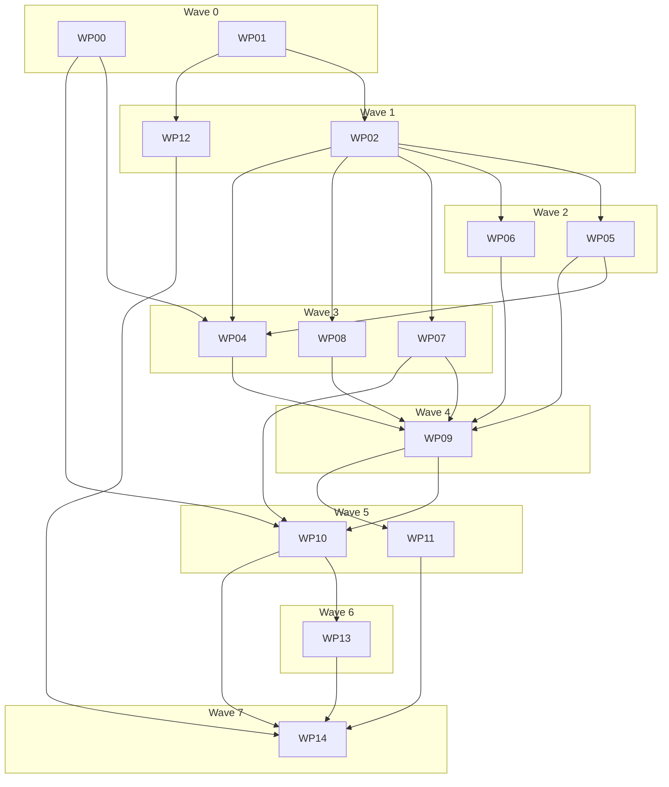

# Plan: ocx-sdk v0.1 walking skeleton

## Status
- State:   executing
- Tier:    high
- Updated: 2026-08-21
- Next:    /hex-execute .claude/artifacts/sdk-v01-plan.md "apply review loop-1 findings"

## Classification
- Scope: large (entire package, both personas)
- Reversibility: one-way (high) — public API + PyPI publication
- Tier: high
- Overlays: architect=inline (design record pre-exists:
  [sdk-design.md](./sdk-design.md), adversarial round 1 applied),
  research=2 live axes (domain axis carried by design-phase research),
  adversary=skip (no adversary skill configured — surfaced in handoff)

## Inputs (read before executing any WP)

| Artifact | Feeds |
|---|---|
| [sdk-design.md](./sdk-design.md) | ALL — the design record; §-refs below are into it |
| [research-ocx-cli-contracts.md](./research-ocx-cli-contracts.md) | WP04, WP09, WP10 — flag surfaces, JSON shapes, exit codes, argv ordering |
| [research-scaffold-state.md](./research-scaffold-state.md) | WP01, WP12 |
| [research-ci-tooling.md](./research-ci-tooling.md) | WP01, WP12 |
| [research-docs-tooling.md](./research-docs-tooling.md) | WP01, WP11 |
| [research-release-pipeline.md](./research-release-pipeline.md) | WP14 |
| `.claude/rules/architecture.md` | every WP — the invariants; auto-loads on src/tests/pyproject |

Non-negotiables inherited from rules (not repeated per WP): contract-first TDD
(stub → failing tests → implement), 100% coverage use-case-first, injectable
clock, zero runtime deps, `task verify` green before every commit, conventional
commits on `feat/sdk-first-draft` only.

## Component contracts

IDs are the traceability keys; full behavior lives in the design §.

- **C-001 `_errors`** (§10): `ExitCode` IntEnum (0,1,64,65,69,74,75,77,78,79,80,81,82);
  hierarchy `OcxError → OcxExecutionError(argv, stderr) → OcxProcessError(exit_code,
  attempts, retryable[fixed: True iff 75]) / OcxTimeoutError`; per-code subclasses;
  `BootstrapError` branch (Download/ChecksumMismatch/DistManifest/UnsupportedPlatform);
  `OcxNotFoundError`, `VersionCompatError`. Stdlib-only leaf; every `__str__`
  names an actionable next step. Edge: exit 1 → plain `OcxProcessError`.
- **C-002 `_types`** (§6,§8,§9,§10): `PackageRef` (carry-don't-parse; `str()`
  byte-roundtrip), `PackageLike`, `BasicAuth`/`BearerAuth` (secret fields
  `repr=False`, masked `__repr__`), `RetryPolicy` (defaults per §10),
  `HostEnv` (ambient/clean/minimal/only/without), `ConstVar`/`PathVar`/`ListVar`
  (kw-only separator)/`EnvValue`, `InstallEnv` StrEnum, `Channel`,
  `TESTED_OCX_VERSION`/`MIN_SUPPORTED` (= pinned ocx at execution time),
  `MANAGED_CONFIG_DISABLED`. All frozen+slots.
- **C-003 `_results`** (§7,§11,§12, contracts artifact): `CommandResult`,
  `EnvReport`/`EnvEntry` (5-array envelope; iterating report = entries; non-entry
  accessors doc-flagged; carries producing HostEnv snapshot for `compose`),
  `VersionInfo`, `AboutInfo`, `StatusReport`, `InspectReport`, `WhichResult`
  (`path`, `kind`), `InfoResult`, `InstallReport` (shape pinned by live probe —
  UNCONFIRMED upstream), `TestResult` (stable v1: `status` decides,
  `assertion.kind` reason). Hand-written `from_dict`, unknown keys ignored,
  one recorded-fixture test per parser. ALL JSON decode lives here.
- **C-004 `_retry`** (§10): pure `_delays(policy)` generator (backoff ×
  multiplier, cap `max_backoff`, full jitter, `Retry-After` honored ≤
  `max_retry_after` else fail); ~15-line sync/async drivers; callers pass
  `classify(failure) -> bool`. Injectable `sleep`/random seam.
- **C-005 `_dist`** (§5): `DistSource.url/path/data`; envelope parse
  (`{latest{channel,version}, latest_next, releases[rows], schema}`); field
  regex validation (filename/tag/target `^[A-Za-z0-9._+-]+$`, version semver,
  sha256 64-hex; reject `..`/separators/CRLF); sha256 auto-derived from
  caller URL for `dist/<sha256>.json` pre-network; **required fail-closed
  off-canonical or with mirror**; auth bound to (scheme,host,port) via
  `add_unredirected_header`; https-only redirect handler, hop cap; userinfo
  rejected; size caps 1 MiB manifest / 256 MiB artifact; transport-condition
  retry classifier (timeouts, reset, 429/5xx).
- **C-006 `_bootstrap`** (§5): `ensure()` exact signature; precedence kwarg >
  `OCX_INSTALL_*` from env > default; cache root refusal (symlink/foreign-uid/
  group-other-writable), dirs 0o700, hit re-hash (opt-out `trust_cache`),
  mkstemp→write→fd-hash→fchmod 0o700→`os.replace`; never-extractall
  single-member stream; uname→triple (parameterized; musl-first Linux, Rosetta
  arm64, Windows msvc); discovery order exe > `OCX_SDK_EXE` > PATH (Windows CWD
  excluded; writable-parent refusal) > `$OCX_HOME/…/current/content/bin/ocx` >
  `OcxNotFoundError`. Never imports runtime modules.
- **C-007 `_config`** (§7): `OcxConfig` frozen slots, all fields per §7 sketch;
  construction-time warning auth∩insecure_registries.
- **C-008 `_envmodel`** (§8): merge (const replaces, path unique-prepends, list
  appends with separator agreement + dedupe); **v0.1 decision: values are
  merged verbatim — the SDK never interpolates `${…}`**; the printenv contract
  diff arbitrates (a diff failure on `${…}` values = doc-flagged limitation +
  upstream issue, not silent interpolation). The merge algorithm lives HERE;
  `EnvReport.compose()` is a thin delegator (function-local import).
  `ComposedEnv.mapping`; `activate()` diff-based revert (touched keys only,
  absent-key delete, finally-guaranteed, unrelated mutations survive),
  process-global single-owner, no lock.
- **C-009 `_env.build_spawn_env`** (§6,§9,§12): filtered HostEnv + config-derived
  vars + `OCX_AUTH_*` passthrough; explicit auth wins per slug; neutralize
  `OCX_PROJECT`/`OCX_GLOBAL`/`OCX_QUIET`; serializer rejects `:`/`=` in keys+
  separators; slug canonicalization port (fixture-tested, mismatch fails
  closed); returns `SpawnEnv(mapping, redact)` where `redact:
  Callable[[str], str]` exact-string-scrubs every configured secret — the
  pinned seam `_process` consumes (no module-global redaction state).
- **C-010 `_process`** (§10,§12): primitives-only interface; argv composition
  = `[exe, *global_flags, *command…]` (global flags BEFORE subcommand —
  live-verified); leading-dash reject + `--` emission; timeout ladder
  communicate→terminate→grace→kill on process group (Windows degraded:
  TerminateProcess only; `capture=False`+timeout documented-degraded); SIGINT
  forwarding on capture=False one-shots; stderr pump thread (line-buffered,
  redacted, DEBUG to `ocx_sdk.process`); async twin with cancellation
  terminating child (gh-88050); `spawn` kwargs filter (reject args/shell/
  executable/env; shell=False invariant); retry driver hookup via ExitCode
  classifier; `on_log` rejected on async paths; takes `redact:
  Callable[[str], str]` explicitly (identity default) — C-009's seam.
- **C-011 `_client`** (§7,§13): `Ocx` — construction factory CONSUMES
  `_bootstrap`'s discovery function (C-006 owns the order; single
  implementation), alt-constructor derivation (never re-discovers),
  `version()` (plain contract), `about()`,
  `login` (`--password-stdin`)/`logout`, `invoke`/`invoke_async`/`spawn`/
  `spawn_async`, `with_config` (shares exe/env/on_log/compat cell),
  `project(path)`, namespaces `package`/`config`/`patch` as stateless
  `@property` wrappers, `__getattr__` hints for `run`/`exec`. `Project` —
  init/add/remove/lock(check)/update/pull(dry_run)/status/inspect/env/run/
  run_async/spawn/spawn_async/with_config; every call injects `--project`.
  `package` namespace: install/select/uninstall/deselect/env/exec/exec_async/
  spawn/spawn_async/which/inspect/info/deps/pull + create/test/push.
  `config.setup`/`config.update`; `patch.sync`. Compat gate on first typed
  call: raise `VersionCompatError` < MIN, DEBUG note > tested. Presentation
  `--format json --color never` pinned on typed methods (exception:
  `version()` plain). Signature-alignment: each method's flags + result struct
  pinned against `research-ocx-cli-contracts.md` + live `--help` probe.
- **C-012 `__init__`** (§4): curated re-exports (the ONLY public path) +
  `__version__`; zero-dep gates (metadata test + import-walk).
- **C-013 packaging/publication** (§15,§17, release research): pyproject
  `[project]` enrichment (classifiers 3.12-3.14, keywords, urls, license-files);
  floor 3.12 everywhere; coverage 100; release.yml proven pattern retained.

## UX scenarios

- **S-001 CI quickstart**: `ensure()` → `Ocx(exe=…)` → `project(...)` →
  `package.install` → `prj.run(["task","verify"])`; errors: no network →
  `DownloadError` naming mirror/pin options; binary missing → `OcxNotFoundError`
  naming `bootstrap.ensure()`.
- **S-002 hermetic env**: `prj.env(...)` under `HostEnv.clean()` → `compose()`
  (base = producing snapshot) → `activate()` → revert leaves foreign mutations
  intact; error: separator conflict → DataError(65) surfaced.
- **S-003 corporate mirror**: `DistSource.url(mirror_manifest, sha256=…)` +
  `mirror_url=` + `BasicAuth`; error: missing sha256 off-canonical → refuse
  pre-network with actionable message; redirect cross-host → auth NOT forwarded.
- **S-004 failure semantics**: registry 429 → exit 75 → retried per policy,
  `attempts` on final error; `login` timeout → NOT retried (mutating default);
  auth 80 → `AuthError`, never retried; checksum mismatch → never retried.
- **S-005 author flow** (acceptance): `package.create` → local registry push →
  `package.test` (status/assertion.kind) → consume via `package.install`.
- **S-006 secret hygiene**: token in `OcxConfig.auth` never appears in repr,
  DEBUG logs, `on_log` lines, exception text, or logged argv.
- **S-007 living docs**: README + guide fences run under Sybil markers; broken
  snippet = red CI.

## Parallelization

| WP | Scope (IDs) | Expected files | Size | Wave | Depends | Review | Status |
|---|---|---|---|---|---|---|---|
| WP00 probe+spike | live `--help` + `--format json` fixture capture for every UNCONFIRMED command (install/info/init/add/remove/lock/update/pull/select/deselect/uninstall/deps/create/test/push/patch sync); author-flow shell spike create→push(local registry:2)→test against pinned binary; registry_slug fixture corpus from ../ocx source at pinned tag; contracts-artifact addendum | .claude/artifacts/research-ocx-cli-contracts.md (addendum), tests/fixtures/cli/*.json, tests/fixtures/cli/*.txt | M | 0 | — | light | merged |
| WP01 scaffold-floor | C-013 part: floor 3.12, cov 100 (pyproject + codecov.yml patch target), ruff D+py312, sybil + pytest-asyncio dev-deps (+ asyncio_mode config), ocx.toml guard tools + ocx.lock regen, taskfile tasks (test passthrough, test:contract/acceptance stubs, lint:actions/lint:links/secrets), lychee.toml, rule bumps | pyproject.toml, taskfile.yml, ocx.toml, ocx.lock, codecov.yml, lychee.toml, .claude/rules/quality-python.md, CLAUDE.md | S | 0 | — | light | merged |
| WP02 foundation | C-001, C-002, C-004, S-004 (error semantics + retry/backoff), S-006 (masked reprs) | src/ocx_sdk/_errors.py, _types.py, _retry.py, tests/unit/test_errors.py, test_types.py, test_retry.py | M | 1 | WP01 | panel | merged |
| WP12 ci | §14 CI table + ci-tooling research: unit matrix 3 OS × 3.12/3.13/3.14 (UV_PYTHON per leg; per-job fail_under=100, NO coverage combine), junit annotation (designated leg only: ubuntu × 3.13), repo-checks job (guard tools), dependabot, SHA-pin setup-ocx in ALL workflows; contract-tier job conditional/stubbed until WP10 | .github/workflows/ci.yml, .github/workflows/docs.yml, .github/workflows/release.yml, .github/dependabot.yml | M | 1 | WP01 | light | merged |
| WP05 config+envmodel | C-007, C-008, S-002 (activate/revert; fail-closed insecure_registries) | _config.py, _envmodel.py, tests/unit/test_config.py, test_envmodel.py | M | 2 | WP02 | panel | merged |
| WP06 spawn-env | C-009, S-006 (owner of test_secrets_absent_from_repr_logs_errors) | _env.py, tests/unit/test_env.py, tests/fixtures/slug_fixtures.json (corpus from WP00) | M | 2 | WP02, WP05 (stub), WP00 | panel | merged |
| WP04 results | C-003 (compose() = thin delegator into _envmodel), S-002 (compose base) | _results.py, tests/unit/test_results.py, tests/fixtures/results/*.json | M | 3 | WP02, WP05, WP00 | light | merged |
| WP07 bootstrap | C-005, C-006, S-003 (mirror+auth, sha256 fail-closed), S-004 (transport retry) | _dist.py, _bootstrap.py, tests/unit/test_dist.py, test_bootstrap.py | L | 3 | WP02 | panel | merged |
| WP08 process | C-010, S-004 (timeout/kill), S-006 (log/error redaction paths) | _process.py, tests/unit/test_process.py | L | 3 | WP02 | panel | merged |
| WP09 client | C-011, C-012, S-001 (quickstart journey), S-004 (mutating retry=None) | _client.py, __init__.py, tests/unit/test_client.py, test_public_surface.py | L | 4 | WP04-08 | panel | merged |
| WP10 contract-tier | §14 contract rows; signature-alignment VERIFICATION (probe fixtures from WP00 are the reference; discrepancy = fix in the owning module via a follow-up commit, not a WP10 rewrite); T1 shape smoke | tests/contract/*, tests/conftest.py (version seam), taskfile test:contract | L | 5 | WP00, WP07, WP09 | panel | merged |
| WP11 docs | S-007, S-001 (doc-form quickstart), §17 | docs/**, README.md, ./conftest.py (repo root — Sybil), mkdocs.yml, pyproject.toml (pytest collection for README/docs) | M | 5 | WP09 | light | merged |
| WP13 acceptance | S-005, §14 acceptance tier; plain registry:2 (tests insecure_registries opt-in path) + htpasswd registry behind self-signed TLS (registry:2 refuses basic auth over plaintext; `htpasswd -Bbn` bcrypt only); exit criterion: acceptance.yml proven green via temporary `pull_request` trigger on the PR | tests/acceptance/*, docker/compose.yml, docker/certs setup, .github/workflows/acceptance.yml, taskfile.yml | L | 6 | WP10 | panel | merged |
| WP14 release-prep | C-013 rest: pyproject metadata, changelog, contributing/releasing docs, CLAUDE.md public-API table + "scaffolding only" line, PR greening, squash; owner-action deliverables: PyPI pending-publisher registration steps + `ocx-sdk` name availability check; post-merge checks: dispatch acceptance.yml + release.yml dry-run | pyproject.toml, docs/contributing/*, CHANGELOG.md, CLAUDE.md, README.md | S | 7 | all | light | merged |

- Critical path: WP01 → WP02 → WP05 → WP04 → WP09 → WP10 → WP13 → WP14.
- Shippable after wave 4: unit-green SDK importable end-to-end (PR turns
  reviewable); after wave 6: release-ready.
- Merge plan (serialized topological order onto `feat/sdk-first-draft`):
  WP00, WP01, WP02, WP12, WP05, WP06, WP04, WP07, WP08, WP09, WP10, WP11,
  WP13, WP14. Draft PR opens after WP01 lands; every wave push must keep
  `task verify` green.
- File-disjointness verified per wave (WP04 fixtures under
  `tests/fixtures/results/`, WP06's under `tests/fixtures/slug_fixtures.json`;
  WP10 owns `tests/conftest.py`, WP11 owns root `./conftest.py`); parallel
  builders use worktree isolation. WP01 stays serial-solo (config files touch
  everything). Former WP03 (retry, ~30 lines) folded into WP02 — sub-overhead,
  shortens critical path one wave. WP14 review bumped to `light` (PyPI-permanent
  metadata is a one-way door).
- WP08 coverage note: the kill-ladder/SIGINT/pump logic reaches 100% unit
  coverage through the fake-Popen + injectable-clock seams (unit tier);
  the §14 contract rows re-verify the same mechanisms against the real
  binary — contract tests are re-verification, never the coverage vehicle.
- Redaction seam (pinned interface): `_env.build_spawn_env(host, config) ->
  SpawnEnv(mapping: dict[str, str], redact: Callable[[str], str])`;
  `_process` functions take `redact` as an explicit parameter (identity
  default). No module-global redaction state, ever.

## Executable phases (per WP, run by /hex-execute)

- **Stub**: module skeleton — full signatures, docstrings (google, concise),
  `raise NotImplementedError`. Public names final at stub time.
- **Specify**: tests written against the stub from C-/S- contracts + the §14
  mechanism→named-test matrix rows for that WP; confirmed failing.
- **Implement**: fill bodies until WP tests + `task verify` green (100% cov of
  the WP's files).
- **Review**: per Review column — `panel` = reviewer:quality + reviewer:security
  (opus) on the WP diff; `light` = single reviewer (sonnet); `self` =
  orchestrator check. Findings fixed before merge.

**WP00 owns the probe**: capture `ocx <cmd> --help` + one real
`--format json` run per UNCONFIRMED command into `tests/fixtures/cli/`, write
a contracts-artifact addendum, run the author-flow shell spike, and extract
the `registry_slug` fixture corpus from the ocx source at the pinned tag
(`../ocx`, Rust unit tests of the slug function — the provenance for WP06's
`slug_fixtures.json`). WP10 then **verifies**: signature-alignment
discrepancies found at WP10 are fixed in the owning module (`_results.py` /
`_client.py`) as ordinary follow-up commits on the integration branch — WP10
itself writes only test files.

## Constitution / rules gate

No constitution file; `.claude/rules/architecture.md` is the binding invariant
set — every WP review checks against it. Zero deviations planned.

## Open questions

None. (Upstream-dependent items tracked in design §18 — not blockers.)

## Deferred findings (from planning review panel)

- Sybil-gated doc examples don't count toward unit-tier coverage — sanity-check
  in WP11 that no src line depends on them for the 100% target (should hold by
  construction).
- Windows `CREATE_NO_WINDOW` for GUI-embedding callers — defer until a real
  use case appears.
- Confirmed non-issue: asyncio ProactorEventLoop is the Windows default since
  3.8; no 3.12–3.14 regression.

## Review round 1 (planning) — resolution record

Panel: reviewer:spec (opus, Request Changes, 15 findings), architect (opus,
Needs Work, 12), researcher (sonnet, Needs Work, 9). ALL actionable findings
applied 2026-08-21: WP00 probe+spike added; WP03 folded into WP02; WP04→wave 3
behind WP05 (compose delegation); WP12→wave 1; WP14→wave 7 + light review;
WP05→panel; redaction seam pinned (SpawnEnv); S-IDs assigned to WPs; §14
matrix extended (+11 rows); interpolation decision recorded; file lists
completed (codecov.yml, ocx.lock, docs/release ymls, root conftest, fixtures
dirs disjoint); asyncio/UV_PYTHON/bcrypt/TLS/junit-leg/coverage-per-job
decisions recorded. Cross-model adversary: skipped — no adversary skill
configured (one review layer missing; hex-review loops post-implementation
compensate).
